   
# ASIC Design

# Table of contents
1. [Compiling the C code in GCC. Here we'll compile a code to calculate sum of numbers from 1 to 10](#Lab1)
2. [Compiling the same C code in RISC V compiler](#Lab2)
3. [Debugging the code in Spike on RISC V](#Lab3)
4. [Instruction formats in RISC V](#Lab4)
5. [Implementation of an application in C language and compiling it in GCC and RISC V GCC](#Lab5)

<a name="Lab1"></a>
## Lab 1 - Compiling the C code in GCC. Here we'll compile a code to calculate sum of numbers from 1 to 10


1. First we'll ensure that we are in home directory. For that we'll type the command cd. Then we'll be using leafpad text editor to write our C code for calculating the sum.
   

    

   

2. Type the code for calculating sum of numbers from 1 to 10 in C language in that text editor and save it
   


3. Now we'll run this programme. Type command gg sum1ton.c & then type ./a.out. This will show the output of our programme.


These are the steps to perform this task

<a name="Lab2"></a>
## Lab 2 - Compiling the same C code in RISC V compiler

1. Here we have first displayed the code our code content. Then using the command showed in the image, we are compiling the code using RISC gcc. Run it and it'll generate a file sum1ton.o
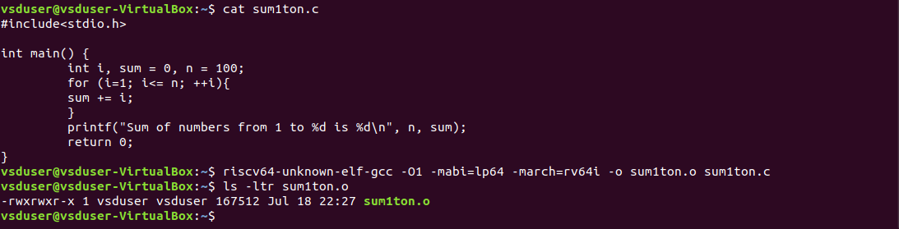

2. Now using the command shown in the figure, we'll get assembly code of our c programme. We'll get a bunch of code. We'll again run the same command adding | less in the end
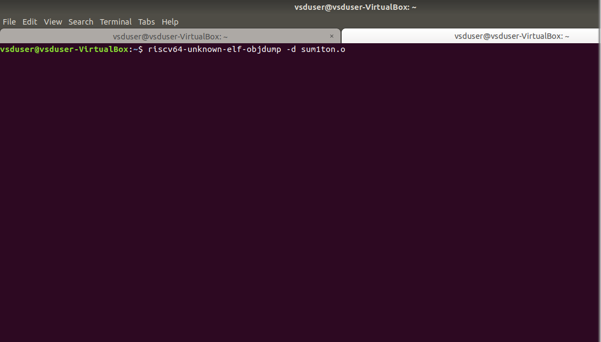

3. We'll get an output again.And since we are interested in main section, we'll directly jump to that section. Now here we'll count no. of instructions. This will be done by subtracting the address of first instruction of current instruction from the same of next section and then it will be divided by 4 since increment is of 4 at every step. This way we'll get to know that there are 15 sets of instructions when we are using O1
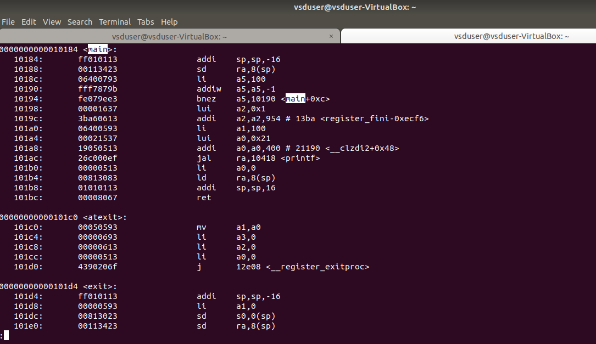

4. Now move back to the first tab, in the command we used for compiling the code, now we'll now use Ofast and will repeat the same process
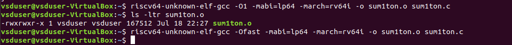

5. Now when you calculate no. of instructions in this case, by the method mentioned in step 3, you'll get no. of instructions here are 12
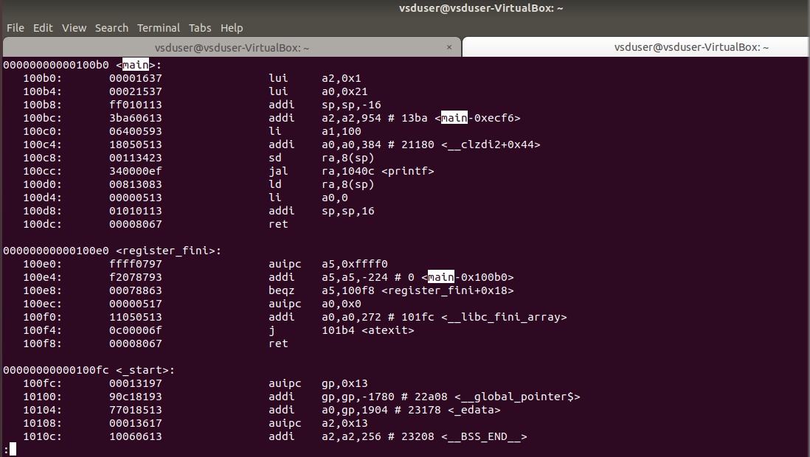

So using Ofast our set of instructions gets reduced as Ofast level applies a wider range of aggressive optimizations that streamline code, eliminate redundancies, and leverage parallelism, resulting in a reduced instruction count compared to O1.

<a name="Lab3"></a>
## Lab 3 - Debugging the code in Spike on RISC V

1. Here first we ran our code on risc v compiler. Now we'll debug it in spike. We'll open spike using the command mentioned
```
spike -d pk sum1ton.o
```
Then we want our programme counter to run till 100b0 (memory address instruction of first location). For that we'll type
```
until pc 0 100b0
```
Now assembly code has all instructions before 100b0


2. The next instruction there basically will modify the content of  a2. Lets check whats the content of a2 with command
```
reg 0 a2
```
Now press enter and it'll run the next instruction which is lui a2, 0x1. This instruction stands for load upper immediate . It'll load upper bits of a2 register by 01. Now again check the content of a2 and you'll see that it has been updated  

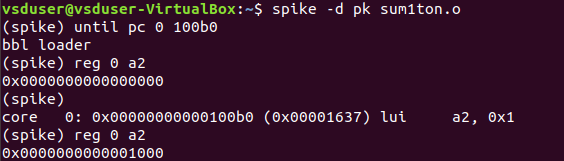

3. Now when you press enter, it'll run the next instruction that is 
```
addi sp,sp,-16
```
This updates the content of sp (stack pointer) by -16 (-10 in hexadecimal). Quit the spike by pressing q.Enter spike again by the command mentioned in step 1. NFrom here we'll go to instruction 100b8 with command
```
until pc 0 100b8
```
check the content of sp with this command
```
reg 0 sp
```
This will show you the content of sp register. Press enter and run the next command. Now if you check content of sp register, you'll see that there is a subtraction of hexadecimal 10.


For refference   

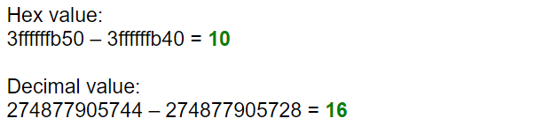

<a name="Lab4"></a>
## Lab 4 - Instruction formats in RISC V
In RISC-V, an instruction is a basic operation that a processor can execute. Each instruction typically corresponds to a single operation that the processor can perform on data, such as arithmetic operations, logical operations, memory operations, control flow operations, and so on. These instructions are encoded as binary values that the processor can interpret and execute.
There are 6 instruction formats in RISC-V:

R-format  
I-format  
S-format  
B-format  
U-format  
J-format  
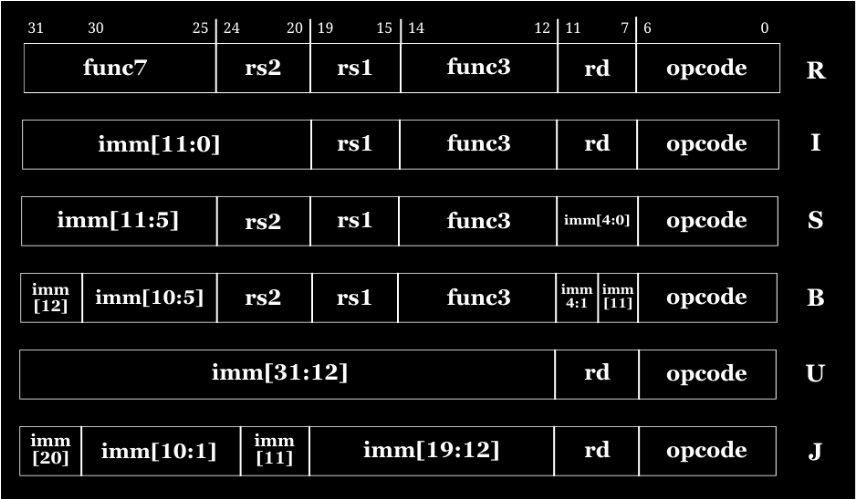

Now before jumping into each format directly, lets take a look of subfields which are going to be there in the instructions. I'll be explaining them here. In case any new instruction is there, it will be explained in that format.  

**opcode**   
Reffered to as opearation code. It is of 7 bit length and it specifies what the instruction does, such as arithmetic operations, logical operations, memory operations, or control flow operations. For example, opcode 0110011 specifies R format.  

**rd**   
It stands for destination register. It is a field in the instruction format that specifies which register will receive the result of an operation.   

**rs1 and rs2**    
They stand for source register 1 and source register 2, respectively. They are fields in the instruction format that specify which registers contain the operands or data used by an instruction.

**func3 and func7**  
func3 provides additional details about the specific operation within the opcode category and func7 basically complements it by providing additional details of same information.

**Immediate**  
It is a constant value that is part of an instruction. It is directly encoded within the instruction's binary representation, typically following the opcode and other necessary fields. In different formats, they occupies different bits, which will be explained furthur in the formats.  

Now lets dive into different formats

## 1. R type instruction
The R type instruction is used for arithmetic and logical operations. These operations are performed on registers and not on memory location. We divide 32 bits into 6 different fields.
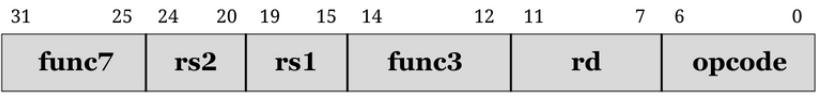
opcode takes 7 bits of length  
rd takes 5 bits of length  
func3 takes 3 bits of length  
rs1 and rs2 takes length of 5 bits  
func7 takes 7 bits of length  

Lets look at some of the variety of examples  

```ADD r6,r7,r8```  
Opcode for ADD = 0110011  
rd = r6 = 00110  
rs1 = r7 = 00111  
rs2 = r8 = 01000  
func3 = 000  
func7 = 0000000  
32 bit pattern: 0000000_01000_00111_000_00110_0110011  

```SUB r8,r6,r7```  
Opcode for SUB = 0110011  
rd = r8 = 01000  
rs1 = r6 = 00110  
rs2 = r7 = 00111  
func3 = 000  
func7 = 0100000   
32 bit pattern: 0100000_00111_00110_000_01000_0110011

```AND r7,r6,r8```   
Opcode for AND = 0110011  
rd = r7 = 00111  
rs1 = r6 = 00110  
rs2 = r8 = 01000  
func3 = 111  
func7 = 0000000   
32 bit pattern: 0000000_01000_00110_111_00111_0110011

```OR r8,r7,r5```  
Opcode for OR = 0110011  
rd = r8 = 01000  
rs1 = r7 = 00111  
rs2 = r8 = 00101  
func3 = 110  
func7 = 0000000   
32 bit pattern: 0000000_00101_00111_110_01000_0110011

```XOR r8,r6,r4```  
Opcode for XOR = 0110011  
rd = r8 = 01000  
rs1 = r6 = 00110  
rs2 = r4 = 00100  
func3 = 100  
func7 = 0000000  
32 bit pattern: 0000000_00100_00110_100_01000_0110011

```SLT r10,r2,r4```  
Opcode for SLT = 0110011  
rd = r10 = 01010  
rs1 = r2 = 00010  
rs2 = r4 = 00100  
func3 = 010  
func7 = 0000000  
32 bit pattern: 0000000_00100_010_01010_0110011

```SRL r16,r11,r2```  
Opcode for SRL = 0110011  
rd = r16 = 10000  
rs1 = r11 = 01011  
rs2 = r2 = 00010  
func3 = 101  
func7 = 0000000  
32 bit pattern: 0000000_00010_01011_101_10000_0110011  

```SLL r15,r11,r2```  
Opcode for SLL = 0110011  
rd = r15 = 011111  
rs1 = r11 = 01011 
rs2 = r2 = 00010
func3 = 001  
func7 = 0000000  
32 bit pattern: 0000000_00010_01011_001_01111_0110011  

## 2. I type instruction
It is designed for instructions that involve an immediate value and a register. These instructions typically perform operations like loading constants into registers, arithmetic and logical operations with immediate operands, and branching based on immediate conditions. Similar to R type, it is also not related to memory location. Here it is divided into 5 fields.

opcode takes 7 bits of length  
rd takes 5 bits of length  
func3 takes 3 bits of length  
rs1 takes length of 5 bits  
12 bits signed immediate, **imm[11:0]** takes 12 bits of length. It provides the constant value used in the addition.  

Lets look at some of the examples

```ADDI r12,r3,5```  
Opcode for ADDI = 0010011  
rd = r12 = 01100  
rs1 = r3 = 00011  
imm[11:0] = 5 = 0000000000101  
func3 = 000  
32 bit pattern: 000000000101_00011_000_01100_0010011   

```LW r13,r11,2```  
Opcode for LW = 0000011  
rd = r12 = 01100  
rs1 = r3 = 01011  
imm[11:0] = 2 = 0000000000010  
func3 = 010  
32 bit pattern: 000000000010_01011_010_01101_0000011

## 3. S type instruction  
It is used for memory store operations. These instructions are responsible for storing data from a register into memory. It is divided into 6 fields.
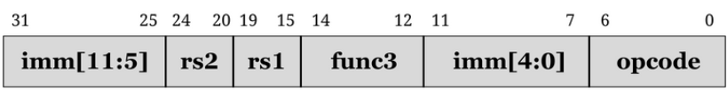
opcode takes 7 bits of length  
Immediate is of 12 bit signed immediate is encoded as follows -  
**imm[11:5] in bits [31:25]  
imm[4:0] in bits [11:7]**  
func3 takes 3 bits of length  
rs1 and rs2 takes length of 5 bits   

Let's look at an example  
```SW r3,r1,4```  
Opcode for SW = 0100011  
rs2 = r3 = 00011  
rs1 = r3 = 00001  
imm[11:0] = 4 = 0000000000100  
func3 = 010  
32 bit pattern: 0000000_00011_010_00100_0100011  

## 4. B type instruction 
 This instruction format is used for branching instructions, which are essential for controlling program flow based on conditions. It is divided into 8 fields.
 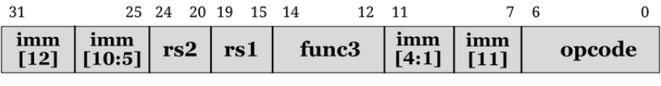
 opcode takes 7 bits of length  
Immediate is of 12 bit signed immediate is encoded as follows -  
**imm[12] in bit [31]  
imm[10:5] in bits [25:30]  
imm[4:1] in bits [11:8]  
imm[11] on bit[7]**   
func3 takes 3 bits of length  
rs1 and rs2 takes length of 5 bits  
When the operation has been performed,  conditions is being checked and value of Programe Counter is being updated. If true,  
PC = Current PC value + Immediate  
If false,  
PC = Current PC value + 4 bytes  

Lets look at some of the examples  

```BNE r0,r1,20```  
Opcode = 1100011  
rs1 = r0 = 00000  
rs2 = r1 = 00001  
imm[12:1] = 20 = 000000010100  
func3 = 001  
32 bit pattern: 0_000001_00001_00000_001_0100_0_1100011  

```BEQ r0,r0,15```  
Opcode = 1100011  
rs1 = r0 = 00000  
rs2 = r0 = 00000  
imm[12:1] = 20 = 000000001111  
func3 = 000  
32 bit pattern: 0_000000_00000_00000_000_1111_0_1100011 

## 5. U type instruction  
It is used for instructions that require a large immediate value to be encoded directly within the instruction itself. This format is primarily used for operations that involve loading constants into registers. It is divided into 3 fields.
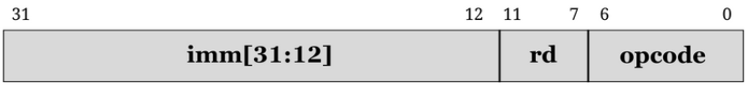
opcode takes 7 bits of length  
rd takes 5 bits of length  
**imm[31:12]** takes 20 bits of length  

## 6. J type instruction  
This instruction is used for commands that allow programs to jump to different parts of their code. This is essential for tasks like repeating actions (loops), calling functions, and managing how instructions run. It is divided into 6 fields.  
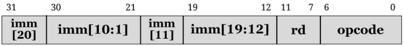
opcode takes 7 bits of length  
rd takes 5 bits of length  
Immediate is of 20 bit signed immediate is encoded as follows -  
**imm[19:12] in bit [19:12]  
imm[11] at bit [20]  
imm[10:1] in bits [30:21]  
imm[20] on bit[31]**


## Functional Simulation
> **_NOTE:_** Here we have used verilog code and testbench of RISCV from the GitHub repository [iiitb_rv32i](https://github.com/iiitb_rv32i).  Also we'll be performing this in Ubuntu itself.

In the code obtained from the reference repository, I have made changes in the instructions. The instructions in my code are the examples I mentioned in the previous task. Testbench code will remain as it is.  
For functional simulation, we'll go through the following steps
1. Open terminal on your Ubuntu  
2. Type cd to ensure  
3. Make a new directory using <span style="background-color: #808080;">mkdir <file_name></span>. In my case, i named it IIITB_  
4. Now create two files for verilog code and testbench code using command <span style="background-color: #808080;">touch</span>. In my case these are AR_Verilog.v and AR_Testbench.v. Then I copied the modified code and pasted it into my verilog file 
5. I used following command to run it  
   ``` iverilog -o AR_Verilog AR_Verilog.v AR_Testbench.v```   
   Then type  
   ``` ./AR_Verilog```  
   Use the command according to the file name you have made.  
6. To see simulation in GTKWave type,  
``` gtkwave_iiitb_rv32i.vcd```  
This will open GTKWave

Before looking at the waveforms, first let us go through the hardcoded ISA and bit pattern of instructions present in referrence repository
|Operation       |        Hardcoded ISA |   Bit Pattern (Hardcoded)
|----------------|----------------------|----------------------------------------------------
|ADD R6, R2, R1  |        32'h02208300  |   0000001 00010 00001 000 00110 0000000
|SUB R7, R1, R2  |        32'h02209380  |   0000001 00010 00001 001 00111 0000000
|AND R8, R1, R3  |        32'h0230a400  |   0000001 00011 00001 010 01000 0000000
|OR R9, R2, R5   |        32'h02513480  |   0000001 00101 00010 011 01001 0000000
|XOR R10, R1, R4 |        32'h0240c500  |   0000001 00100 00001 100 01010 0000000
|SLT R1, R2, R4  |        32'h02415580  |   0000001 00100 00010 101 01011 0000000  
|ADDI R12, R4, 5 |        32'h00520600  |   000000000101 00100 000 01100 0000000  
|BEQ R0, R0, 15  |    32'h00f00002  |   0 000000 01111 00000 000 0000 0 0000010
|SW R3, R1, 2    |    32'h00209181  |   0000000 00010 00001 001 00011 0000001
|LW R13, R1, 2   |        32'h00208681  |   000000000010 00001 000 01101 0000001  
|SRL R16, R14, R2|        32'h00271803  |   0000000 00010 01110 001 10000 0000011
|SLL R15, R1, R2 |        32'h00208783  |   0000000 00010 00001 000 01111 0000011

Now lets look into the RISC V ISA and 32 bit pattern of instructions mentioned in the previous activity.  

|Operation       |        RISCV ISA |   Bit Pattern (Hardcoded)
|----------------|----------------------|----------------------------------------------------
|ADD R6, R7, R8  |        32'h00840333  |   0000000 01000 01000 000 00110 0110011
|SUB R8, R6, R7  |        32'h40730433  |   0100000 00111 00110 000 01000 0110011
|AND R7, R6, R8  |        32'h008373b3  |   0000000 00111 00110 000 01000 0110011
|OR R8, R7, R5   |        32'h0053e433  |   0000000 00101 00111 110 01000 0110011
|XOR R8, R6, R4 |        32'h00434433  |   0000000 00100 00110 100 01000 0110011
|SLT R10, R2, R4  |        32'h00412533  |   0000000 00100 00010 010 01010 0110011  
|ADDI R12, R3, 5 |        32'h00518613  |   000000000101 00011 000 01100 0010011  
|SW R3, R1, 4  |    32'h0030A223  |   0000000 00011 00001 010 00100 0100011
|SRL R16, R11, R2    |    32'h0025d833  |   0000000 00010 01011 101 10000 0110011
|BNE R0, R1, 20   |        32'h02101463  |   0 000001 00001 00000 001 0100 0 1100011  
|BEQ R0, R0, 15|        32'h000000f63  |   0 000000 00000 00000 000 1111 0 1100011
|LW R13, R11, 2 |        32'h0025a683  |   000000000010 01011 010 01101 0000011
|SLL R15, R11, R2 |        32'h002597b3  |   0000000 00010 01011 001 01111 0110011

Although the instructions are different in both of the above tables and we cannot compare them, but still we can point out to some differences in case of same instruction type -   
1. The opcode for instruction type R, I and B is different  
2. The func3 and func7 are different in R type instruction  

This difference is there because these instructions in the verilog file are hard-coded, meaning they are done by the designer based on his or her own pattern. He or she hasn't followed the RISCV specification bit pattern. 

### Output Waveforms 
Let's look at waveform of some of the instructions  

ADD R6, R2, R1  


SUB R7, R1, R2  


AND R8, R1, R3  


OR R9, R2, R5  


XOR R10, R1, R4  


SLT R1, R2, R4  


ADDI R12, R4, 5  


BEQ R0, R0, 15
  

Let's look at waveform of some of the instructions which were there in the previous activity   

ADD R6,R7,R8  


SUB R8,R6,R7  


AND R7,R6,R8  


OR R8,R7,R5   


XOR R8,R6,R4   


SLT R10,R2,R4  


ADDI R12,R3,5  


SW R3,R1,4  


SRL R16,R11,R2  

 
BNE R0,R1,20  


BEQ R0,R0,15  


SLL R15,R11,R2  


<a name="Lab5"></a>
## Lab 5 - Implementation of an application in C language and compiling it in GCC and RISC V GCC
1. This is our C program. It calculates the mileage of the car and based on that provides on whether air conditioner should be used or not. This helps in fuel efficiency.
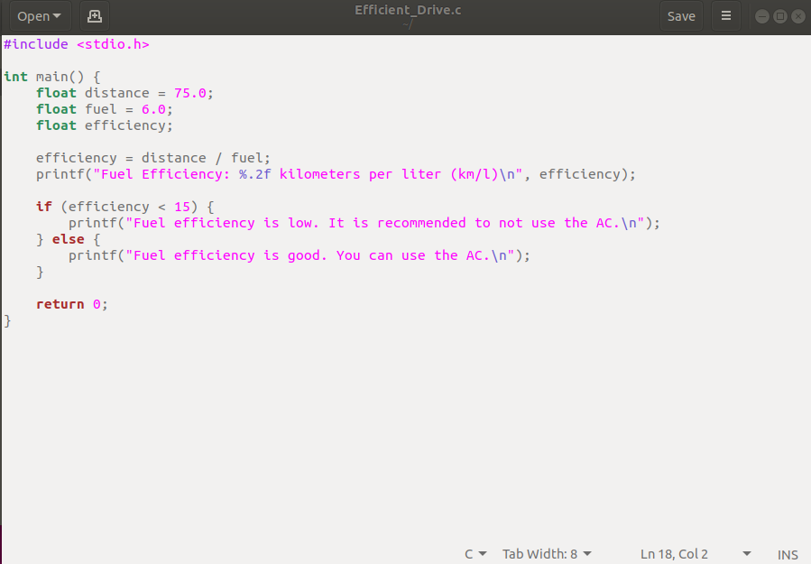  

2. In this step we will compile it using GCC. Then we'll check its output. I also checked the content of code written in Efficient drive. (Please refer to task 1 for explanation)
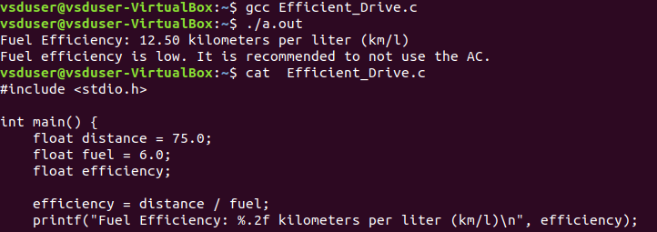  

3. In this step we'll run our code on RISC V using compiler optimization flags O1 and Ofast.We'll be looking into instructuions set of both compliations
O1. (Please refer to task 2 for explanation)  
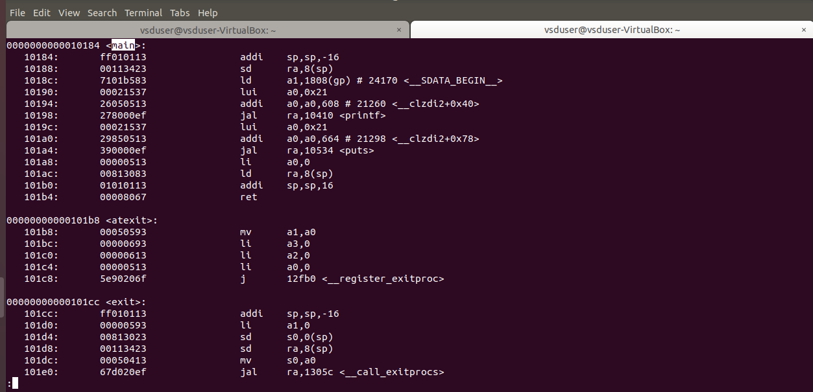    
Ofast  
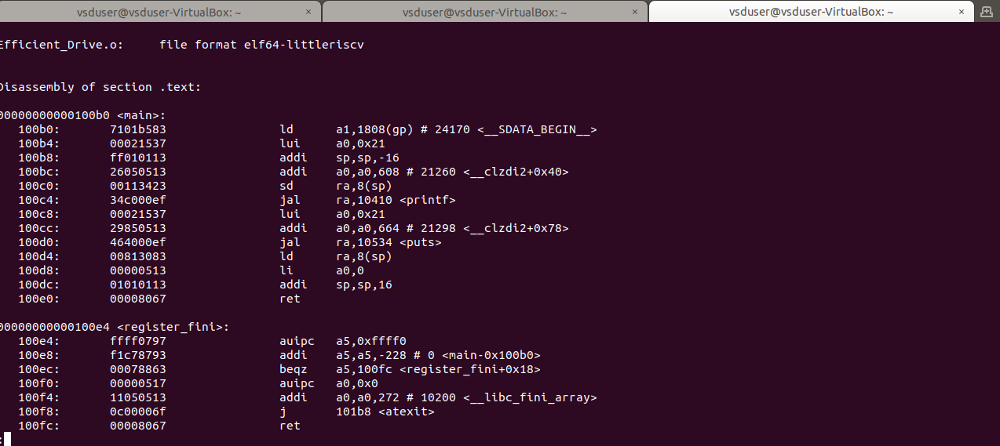  

4. Now we'll check the output of our code in RISC V
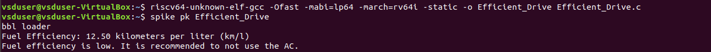  

5. In the final step we'll debug our code in spike on RISC V  
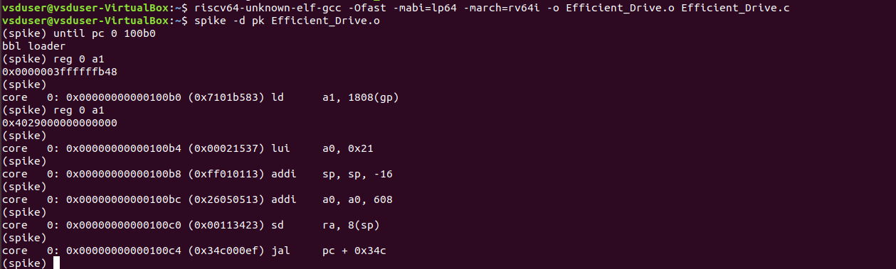  


