   
# ASIC Design

# Table of contents
1. [Compiling the C code in GCC. Here we'll compile a code to calculate sum of numbers from 1 to 10](#Lab1)
2. [Compiling the same C code in RISC V compiler](#Lab2)
3. [Debugging the code in Spike on RISC V](#Lab3)
4. [Instruction formats in RISC V](#Lab4)
5. [Implementation of an application in C language and compiling it in GCC and RISC V GCC](#Lab5)
6. [Building 5-stage pipelined RISC-V processor](#Lab6)
7. [Risc V CPU tlv code to verilog code conversion](#Lab7)  
8. [BabySoc Simulation](#Lab8)
9. [RTL Design using Verilog and SKY130 Technology](#Lab9)
10. [Synthesizing RISC-V using Yosys and post synthesis  BabySoc Simulation](#Lab10)    
11. [STA for Synthesized Risc-V Core with OpenSTA ](#Lab11) 
12. [PVT Corner Analysis using OpenSTA](#Lab12)  
13. [Physical Design using Openlane](#Lab13)  
14. [RTL to GDSII flow for the RVMYTH RISC-V core and VSDBabySoC](#Lab14)

<a name="Lab1"></a>
# Lab 1 - Compiling the C code in GCC. Here we'll compile a code to calculate sum of numbers from 1 to 10


1. First we'll ensure that we are in home directory. For that we'll type the command cd. Then we'll be using leafpad text editor to write our C code for calculating the sum.
   

    

   

2. Type the code for calculating sum of numbers from 1 to 10 in C language in that text editor and save it
   


3. Now we'll run this programme. Type command gg sum1ton.c & then type ./a.out. This will show the output of our programme.


These are the steps to perform this task

<a name="Lab2"></a>
# Lab 2 - Compiling the same C code in RISC V compiler

1. Here we have first displayed the code our code content. Then using the command showed in the image, we are compiling the code using RISC gcc. Run it and it'll generate a file sum1ton.o


2. Now using the command shown in the figure, we'll get assembly code of our c programme. We'll get a bunch of code. We'll again run the same command adding | less in the end


3. We'll get an output again.And since we are interested in main section, we'll directly jump to that section. Now here we'll count no. of instructions. This will be done by subtracting the address of first instruction of current instruction from the same of next section and then it will be divided by 4 since increment is of 4 at every step. This way we'll get to know that there are 15 sets of instructions when we are using O1


4. Now move back to the first tab, in the command we used for compiling the code, now we'll now use Ofast and will repeat the same process


5. Now when you calculate no. of instructions in this case, by the method mentioned in step 3, you'll get no. of instructions here are 12


So using Ofast our set of instructions gets reduced as Ofast level applies a wider range of aggressive optimizations that streamline code, eliminate redundancies, and leverage parallelism, resulting in a reduced instruction count compared to O1.

<a name="Lab3"></a>
# Lab 3 - Debugging the code in Spike on RISC V

1. Here first we ran our code on risc v compiler. Now we'll debug it in spike. We'll open spike using the command mentioned
```
spike -d pk sum1ton.o
```
Then we want our programme counter to run till 100b0 (memory address instruction of first location). For that we'll type
```
until pc 0 100b0
```
Now assembly code has all instructions before 100b0


2. The next instruction there basically will modify the content of  a2. Lets check whats the content of a2 with command
```
reg 0 a2
```
Now press enter and it'll run the next instruction which is lui a2, 0x1. This instruction stands for load upper immediate . It'll load upper bits of a2 register by 01. Now again check the content of a2 and you'll see that it has been updated  


3. Now when you press enter, it'll run the next instruction that is 
```
addi sp,sp,-16
```
This updates the content of sp (stack pointer) by -16 (-10 in hexadecimal). Quit the spike by pressing q.Enter spike again by the command mentioned in step 1. NFrom here we'll go to instruction 100b8 with command
```
until pc 0 100b8
```
check the content of sp with this command
```
reg 0 sp
```
This will show you the content of sp register. Press enter and run the next command. Now if you check content of sp register, you'll see that there is a subtraction of hexadecimal 10.


For refference   


<a name="Lab4"></a>
# Lab 4 - Instruction formats in RISC V
In RISC-V, an instruction is a basic operation that a processor can execute. Each instruction typically corresponds to a single operation that the processor can perform on data, such as arithmetic operations, logical operations, memory operations, control flow operations, and so on. These instructions are encoded as binary values that the processor can interpret and execute.
There are 6 instruction formats in RISC-V:

R-format  
I-format  
S-format  
B-format  
U-format  
J-format  


Now before jumping into each format directly, lets take a look of subfields which are going to be there in the instructions. I'll be explaining them here. In case any new instruction is there, it will be explained in that format.  

**opcode**   
Reffered to as opearation code. It is of 7 bit length and it specifies what the instruction does, such as arithmetic operations, logical operations, memory operations, or control flow operations. For example, opcode 0110011 specifies R format.  

**rd**   
It stands for destination register. It is a field in the instruction format that specifies which register will receive the result of an operation.   

**rs1 and rs2**    
They stand for source register 1 and source register 2, respectively. They are fields in the instruction format that specify which registers contain the operands or data used by an instruction.

**func3 and func7**  
func3 provides additional details about the specific operation within the opcode category and func7 basically complements it by providing additional details of same information.

**Immediate**  
It is a constant value that is part of an instruction. It is directly encoded within the instruction's binary representation, typically following the opcode and other necessary fields. In different formats, they occupies different bits, which will be explained furthur in the formats.  

Now lets dive into different formats

## 1. R type instruction
The R type instruction is used for arithmetic and logical operations. These operations are performed on registers and not on memory location. We divide 32 bits into 6 different fields.

opcode takes 7 bits of length  
rd takes 5 bits of length  
func3 takes 3 bits of length  
rs1 and rs2 takes length of 5 bits  
func7 takes 7 bits of length  

Lets look at some of the variety of examples  

```ADD r6,r7,r8```  
Opcode for ADD = 0110011  
rd = r6 = 00110  
rs1 = r7 = 00111  
rs2 = r8 = 01000  
func3 = 000  
func7 = 0000000  
32 bit pattern: 0000000_01000_00111_000_00110_0110011  

```SUB r8,r6,r7```  
Opcode for SUB = 0110011  
rd = r8 = 01000  
rs1 = r6 = 00110  
rs2 = r7 = 00111  
func3 = 000  
func7 = 0100000   
32 bit pattern: 0100000_00111_00110_000_01000_0110011

```AND r7,r6,r8```   
Opcode for AND = 0110011  
rd = r7 = 00111  
rs1 = r6 = 00110  
rs2 = r8 = 01000  
func3 = 111  
func7 = 0000000   
32 bit pattern: 0000000_01000_00110_111_00111_0110011

```OR r8,r7,r5```  
Opcode for OR = 0110011  
rd = r8 = 01000  
rs1 = r7 = 00111  
rs2 = r8 = 00101  
func3 = 110  
func7 = 0000000   
32 bit pattern: 0000000_00101_00111_110_01000_0110011

```XOR r8,r6,r4```  
Opcode for XOR = 0110011  
rd = r8 = 01000  
rs1 = r6 = 00110  
rs2 = r4 = 00100  
func3 = 100  
func7 = 0000000  
32 bit pattern: 0000000_00100_00110_100_01000_0110011

```SLT r10,r2,r4```  
Opcode for SLT = 0110011  
rd = r10 = 01010  
rs1 = r2 = 00010  
rs2 = r4 = 00100  
func3 = 010  
func7 = 0000000  
32 bit pattern: 0000000_00100_010_01010_0110011

```SRL r16,r11,r2```  
Opcode for SRL = 0110011  
rd = r16 = 10000  
rs1 = r11 = 01011  
rs2 = r2 = 00010  
func3 = 101  
func7 = 0000000  
32 bit pattern: 0000000_00010_01011_101_10000_0110011  

```SLL r15,r11,r2```  
Opcode for SLL = 0110011  
rd = r15 = 011111  
rs1 = r11 = 01011 
rs2 = r2 = 00010
func3 = 001  
func7 = 0000000  
32 bit pattern: 0000000_00010_01011_001_01111_0110011  

## 2. I type instruction
It is designed for instructions that involve an immediate value and a register. These instructions typically perform operations like loading constants into registers, arithmetic and logical operations with immediate operands, and branching based on immediate conditions. Similar to R type, it is also not related to memory location. Here it is divided into 5 fields.

opcode takes 7 bits of length  
rd takes 5 bits of length  
func3 takes 3 bits of length  
rs1 takes length of 5 bits  
12 bits signed immediate, **imm[11:0]** takes 12 bits of length. It provides the constant value used in the addition.  

Lets look at some of the examples

```ADDI r12,r3,5```  
Opcode for ADDI = 0010011  
rd = r12 = 01100  
rs1 = r3 = 00011  
imm[11:0] = 5 = 0000000000101  
func3 = 000  
32 bit pattern: 000000000101_00011_000_01100_0010011   

```LW r13,r11,2```  
Opcode for LW = 0000011  
rd = r12 = 01100  
rs1 = r3 = 01011  
imm[11:0] = 2 = 0000000000010  
func3 = 010  
32 bit pattern: 000000000010_01011_010_01101_0000011

## 3. S type instruction  
It is used for memory store operations. These instructions are responsible for storing data from a register into memory. It is divided into 6 fields.

opcode takes 7 bits of length  
Immediate is of 12 bit signed immediate is encoded as follows -  
**imm[11:5] in bits [31:25]  
imm[4:0] in bits [11:7]**  
func3 takes 3 bits of length  
rs1 and rs2 takes length of 5 bits   

Let's look at an example  
```SW r3,r1,4```  
Opcode for SW = 0100011  
rs2 = r3 = 00011  
rs1 = r3 = 00001  
imm[11:0] = 4 = 0000000000100  
func3 = 010  
32 bit pattern: 0000000_00011_010_00100_0100011  

## 4. B type instruction 
 This instruction format is used for branching instructions, which are essential for controlling program flow based on conditions. It is divided into 8 fields.
 
 opcode takes 7 bits of length  
Immediate is of 12 bit signed immediate is encoded as follows -  
**imm[12] in bit [31]  
imm[10:5] in bits [25:30]  
imm[4:1] in bits [11:8]  
imm[11] on bit[7]**   
func3 takes 3 bits of length  
rs1 and rs2 takes length of 5 bits  
When the operation has been performed,  conditions is being checked and value of Programe Counter is being updated. If true,  
PC = Current PC value + Immediate  
If false,  
PC = Current PC value + 4 bytes  

Lets look at some of the examples  

```BNE r0,r1,20```  
Opcode = 1100011  
rs1 = r0 = 00000  
rs2 = r1 = 00001  
imm[12:1] = 20 = 000000010100  
func3 = 001  
32 bit pattern: 0_000001_00001_00000_001_0100_0_1100011  

```BEQ r0,r0,15```  
Opcode = 1100011  
rs1 = r0 = 00000  
rs2 = r0 = 00000  
imm[12:1] = 20 = 000000001111  
func3 = 000  
32 bit pattern: 0_000000_00000_00000_000_1111_0_1100011 

## 5. U type instruction  
It is used for instructions that require a large immediate value to be encoded directly within the instruction itself. This format is primarily used for operations that involve loading constants into registers. It is divided into 3 fields.

opcode takes 7 bits of length  
rd takes 5 bits of length  
**imm[31:12]** takes 20 bits of length  

## 6. J type instruction  
This instruction is used for commands that allow programs to jump to different parts of their code. This is essential for tasks like repeating actions (loops), calling functions, and managing how instructions run. It is divided into 6 fields.  

opcode takes 7 bits of length  
rd takes 5 bits of length  
Immediate is of 20 bit signed immediate is encoded as follows -  
**imm[19:12] in bit [19:12]  
imm[11] at bit [20]  
imm[10:1] in bits [30:21]  
imm[20] on bit[31]**


## Functional Simulation
> **_NOTE:_** Here we have used verilog code and testbench of RISCV from the GitHub repository [iiitb_rv32i](https://github.com/iiitb_rv32i).  Also we'll be performing this in Ubuntu itself.

In the code obtained from the reference repository, I have made changes in the instructions. The instructions in my code are the examples I mentioned in the previous task. Testbench code will remain as it is.  
For functional simulation, we'll go through the following steps
1. Open terminal on your Ubuntu  
2. Type cd to ensure  
3. Make a new directory using <span style="background-color: #808080;">mkdir <file_name></span>. In my case, i named it IIITB_  
4. Now create two files for verilog code and testbench code using command <span style="background-color: #808080;">touch</span>. In my case these are AR_Verilog.v and AR_Testbench.v. Then I copied the modified code and pasted it into my verilog file 
5. I used following command to run it  
   ``` iverilog -o AR_Verilog AR_Verilog.v AR_Testbench.v```   
   Then type  
   ``` ./AR_Verilog```  
   Use the command according to the file name you have made.  
6. To see simulation in GTKWave type,  
``` gtkwave_iiitb_rv32i.vcd```  
This will open GTKWave

Before looking at the waveforms, first let us go through the hardcoded ISA and bit pattern of instructions present in referrence repository
|Operation       |        Hardcoded ISA |   Bit Pattern (Hardcoded)
|----------------|----------------------|----------------------------------------------------
|ADD R6, R2, R1  |        32'h02208300  |   0000001 00010 00001 000 00110 0000000
|SUB R7, R1, R2  |        32'h02209380  |   0000001 00010 00001 001 00111 0000000
|AND R8, R1, R3  |        32'h0230a400  |   0000001 00011 00001 010 01000 0000000
|OR R9, R2, R5   |        32'h02513480  |   0000001 00101 00010 011 01001 0000000
|XOR R10, R1, R4 |        32'h0240c500  |   0000001 00100 00001 100 01010 0000000
|SLT R1, R2, R4  |        32'h02415580  |   0000001 00100 00010 101 01011 0000000  
|ADDI R12, R4, 5 |        32'h00520600  |   000000000101 00100 000 01100 0000000  
|BEQ R0, R0, 15  |    32'h00f00002  |   0 000000 01111 00000 000 0000 0 0000010
|SW R3, R1, 2    |    32'h00209181  |   0000000 00010 00001 001 00011 0000001
|LW R13, R1, 2   |        32'h00208681  |   000000000010 00001 000 01101 0000001  
|SRL R16, R14, R2|        32'h00271803  |   0000000 00010 01110 001 10000 0000011
|SLL R15, R1, R2 |        32'h00208783  |   0000000 00010 00001 000 01111 0000011

Now lets look into the RISC V ISA and 32 bit pattern of instructions mentioned in the previous activity.  

|Operation       |        RISCV ISA |   Bit Pattern (Hardcoded)
|----------------|----------------------|----------------------------------------------------
|ADD R6, R7, R8  |        32'h00840333  |   0000000 01000 01000 000 00110 0110011
|SUB R8, R6, R7  |        32'h40730433  |   0100000 00111 00110 000 01000 0110011
|AND R7, R6, R8  |        32'h008373b3  |   0000000 00111 00110 000 01000 0110011
|OR R8, R7, R5   |        32'h0053e433  |   0000000 00101 00111 110 01000 0110011
|XOR R8, R6, R4 |        32'h00434433  |   0000000 00100 00110 100 01000 0110011
|SLT R10, R2, R4  |        32'h00412533  |   0000000 00100 00010 010 01010 0110011  
|ADDI R12, R3, 5 |        32'h00518613  |   000000000101 00011 000 01100 0010011  
|SW R3, R1, 4  |    32'h0030A223  |   0000000 00011 00001 010 00100 0100011
|SRL R16, R11, R2    |    32'h0025d833  |   0000000 00010 01011 101 10000 0110011
|BNE R0, R1, 20   |        32'h02101463  |   0 000001 00001 00000 001 0100 0 1100011  
|BEQ R0, R0, 15|        32'h000000f63  |   0 000000 00000 00000 000 1111 0 1100011
|LW R13, R11, 2 |        32'h0025a683  |   000000000010 01011 010 01101 0000011
|SLL R15, R11, R2 |        32'h002597b3  |   0000000 00010 01011 001 01111 0110011

Although the instructions are different in both of the above tables and we cannot compare them, but still we can point out to some differences in case of same instruction type -   
1. The opcode for instruction type R, I and B is different  
2. The func3 and func7 are different in R type instruction  

This difference is there because these instructions in the verilog file are hard-coded, meaning they are done by the designer based on his or her own pattern. He or she hasn't followed the RISCV specification bit pattern. 

### Output Waveforms 
Let's look at waveform of some of the instructions  

ADD R6, R2, R1  


SUB R7, R1, R2  


AND R8, R1, R3  


OR R9, R2, R5  


XOR R10, R1, R4  


SLT R1, R2, R4  


ADDI R12, R4, 5  


BEQ R0, R0, 15
  

Let's look at waveform of some of the instructions which were there in the previous activity   

ADD R6,R7,R8  


SUB R8,R6,R7  


AND R7,R6,R8  


OR R8,R7,R5   


XOR R8,R6,R4   


SLT R10,R2,R4  


ADDI R12,R3,5  


SW R3,R1,4  


SRL R16,R11,R2  

 
BNE R0,R1,20  


BEQ R0,R0,15  


SLL R15,R11,R2  


<a name="Lab5"></a>
# Lab 5 - Implementation of an application in C language and compiling it in GCC and RISC V GCC
1. This is our C program. It calculates the mileage of the car and based on that provides on whether air conditioner should be used or not. This helps in fuel efficiency.
  

2. In this step we will compile it using GCC. Then we'll check its output. I also checked the content of code written in Efficient drive. (Please refer to task 1 for explanation)
  

3. In this step we'll run our code on RISC V using compiler optimization flags O1 and Ofast.We'll be looking into instructuions set of both compliations
O1. (Please refer to task 2 for explanation)  
O1
    
Ofast  
  

4. Now we'll check the output of our code in RISC V
  

5. In the final step we'll debug our code in spike on RISC V  
  

<a name="Lab6"></a>
# Lab 6 - Building 5-stage pipelined RISC-V processor  

### TL Verilog  
TL Verilog is a higher-level abstraction of Verilog used to model and verify digital systems by focusing on transactions rather than detailed signal manipulations. It simplifies the design process by allowing engineers to describe complex interactions and data exchanges between components at a more abstract level, making the code more readable and maintainable. TL Verilog is particularly useful in conjunction with verification methodologies and tools like SystemVerilog and UVM, streamlining the verification of intricate systems-on-chip and improving overall design efficiency.

### Makerchip for TL Verilog  
Using Makerchip for TL Verilog offers several advantages, particularly for those interested in transaction-level modeling and verification:

1) Interactive Environment: Makerchip provides a web-based platform where you can write, simulate, and test TL Verilog code in real-time. This interactive environment is ideal for experimenting with transaction-level models without needing complex software installations.

2) Educational Resources: Makerchip includes tutorials, examples, and documentation that can help you get up to speed with TL Verilog. It’s a useful tool for learning how to model and verify systems at a higher abstraction level.

3) Ease of Use: The platform simplifies the process of running simulations and debugging TL Verilog code. Its user-friendly interface can make it easier to understand and visualize transaction-level interactions and behaviors.  

### Simple calculator in Makerchip  
My calculator consists of these operations  
   ```   $sum[31:0] = $val1[31:0] + $val2[31:0];  
         $diff[31:0] = $val1[31:0] - $val2[31:0];  
         $and[31:0] = $val1[31:0] && $val2[31:0];  
         $or[31:0] = $val1[31:0] || $val2[31:0];
```
To implement them, we have used a 4x1 MUX. In TL verilog, it is implemented like this  
``` 
 $out[31:0] = $valid_or_reset ? 32'b0 :  
                 ($sel[2:0] == 3'd0) ? $sum  
                 : ($sel[2:0] == 3'd1) ? $diff  
                 : ($sel[2:0] == 3'd2) ? $and   
                 : ($sel[2:0] == 3'd3) ? $or  
                 : >>2$mem[31:0];
```  
Here's the snapshot  
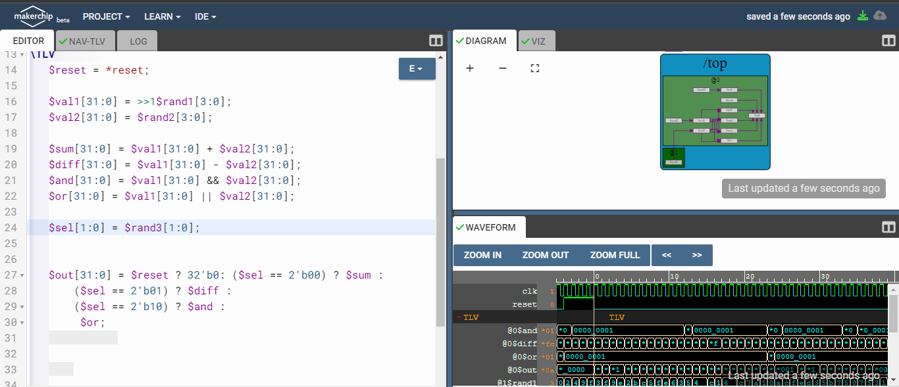 

### Free running counter  
Here we'll add a counter that adds integer 1 to $num1 at each clock. The following code is used for the same  
``` $num1[31:0] = $reset ? 0 : >>1$num1[31:0] + 1; ```  
 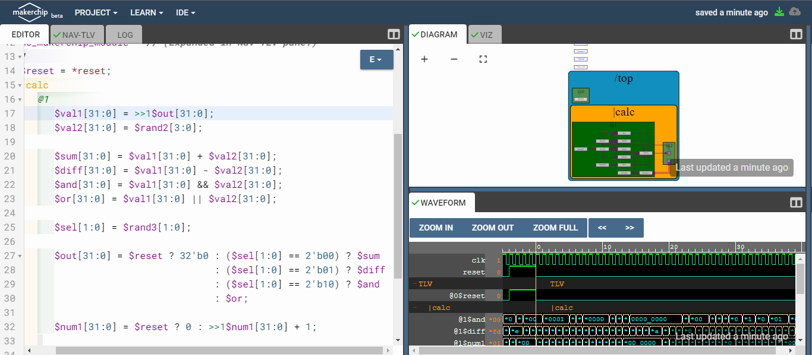  

 ### Pipelined Sequential Calculator  
 As noted earlier, sequential logic involves using values from different clock cycles than those where operations occur, a concept demonstrated in the Free Running Counter example. Moving forward, our calculator has been updated to "store" values using a Flip-Flop, with the value from $out[31:0] now being sent to $val1[31:0]. In Verilog, pipelining is implemented by designing a series of sequential stages, each as a separate module or block of logic, connected through registers. Each stage handles a part of the computation, passing data to the next stage with each clock cycle. For this example, we will integrate the Counter and Calculator into a single pipeline stage. To initiate a pipeline, use the command |cacl with proper indentation, and to assign a pipelining stage to a set of operations or a module, use the command @int, where the integer value represents the stage related to the clock cycle.  

Reference snapshot  
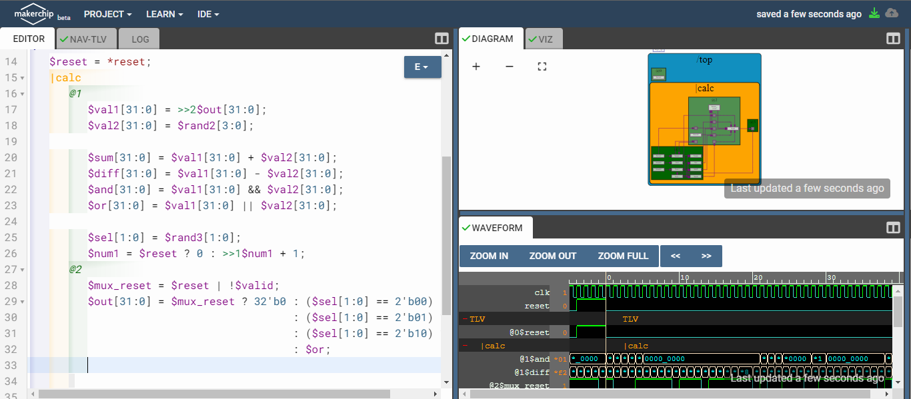  

Reference code  
``` $reset = *reset;
   |calc
      @1
         $val1[31:0] = >>2$out[31:0];
         $val2[31:0] = $rand2[3:0];
   
         $sum[31:0] = $val1[31:0] + $val2[31:0];
         $diff[31:0] = $val1[31:0] - $val2[31:0];
         $and[31:0] = $val1[31:0] && $val2[31:0];
         $or[31:0] = $val1[31:0] || $val2[31:0];
   
         $sel[2:0] = $rand3[2:0];
         $num1 = $reset ? 0 : >>1$num1 + 1;
      @2
         $valid_or_reset = $reset || $valid;  
         $mem[31:0] = $valid_or_reset ? 0 :  
                      ($sel[2:0] == 3'd5) ? 
                      >>2$out[31:0]: >>2$mem[31:0]; 
         
         
         
         
         $out[31:0] = $valid_or_reset ? 32'b0 :($sel        [2:0] == 3'd0) ? $sum
                     : ($sel[2:0] == 3'd1) ? $diff
                     : ($sel[2:0] == 3'd2) ? $and
                     : ($sel[2:0] == 3'd3) ? $or
                     : >>2$mem[31:0];  
   ```

## Basic RISC-V CPU micro-architecture    
In this section we are going to code for the following cases -  
1) Program counter
2) Instruction fetch
3) Instruction decode
4) Extracting instruction fileds
5) Decoding instructions  
6) Register file read
7) ALU operations for ADD/ADDI
8) Register file write  
9) Implementing branch instruction 
10) Testbench 
    
Here we have the snapshot for each case  -

1) 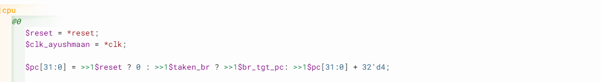  
  
2) 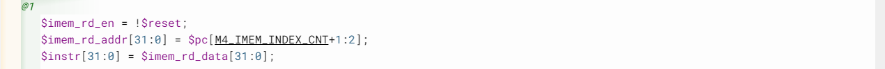

   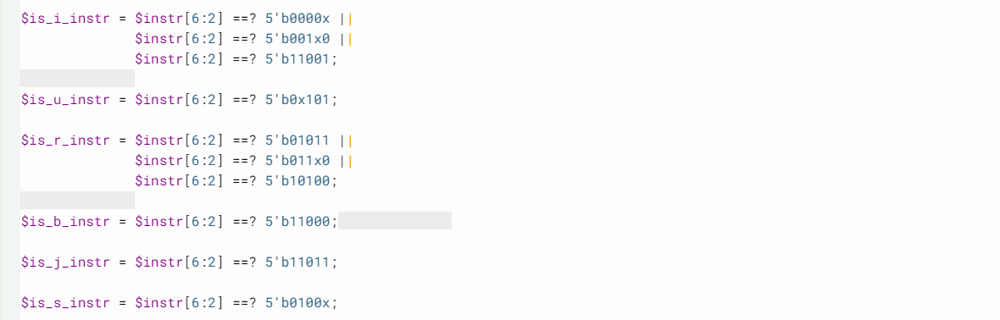
3) 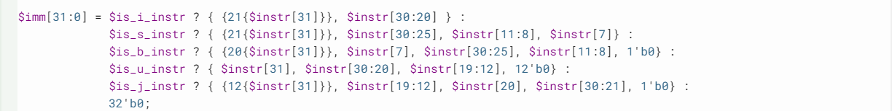

4) 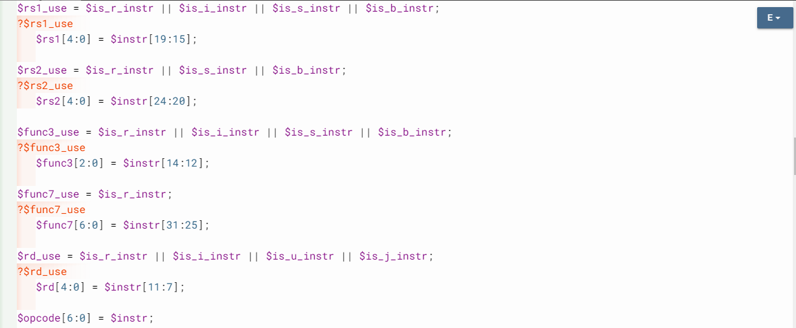

5) 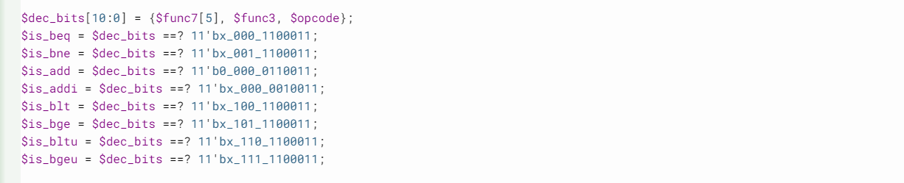  

6) 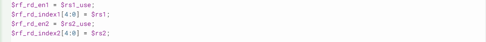  

7) 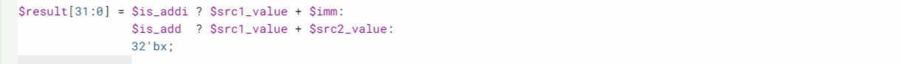 

8) 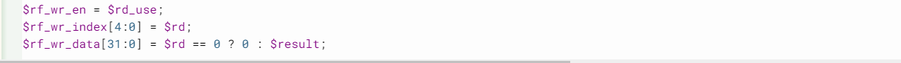

9) 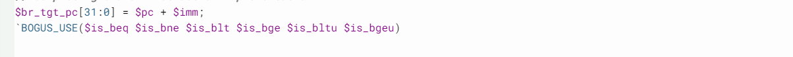

10) 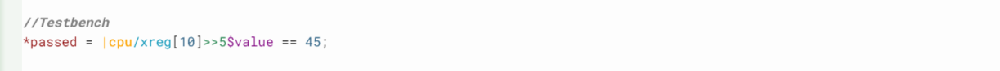

Here I have attached the log files, visual, waveform and diagram of my code  

1) Log file 
   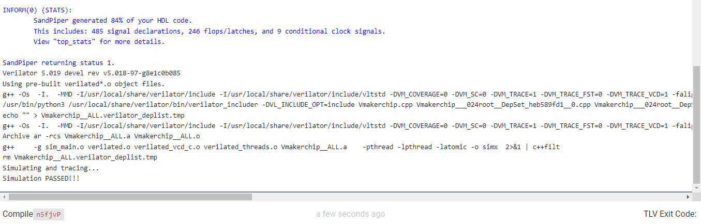   

2) Visual
   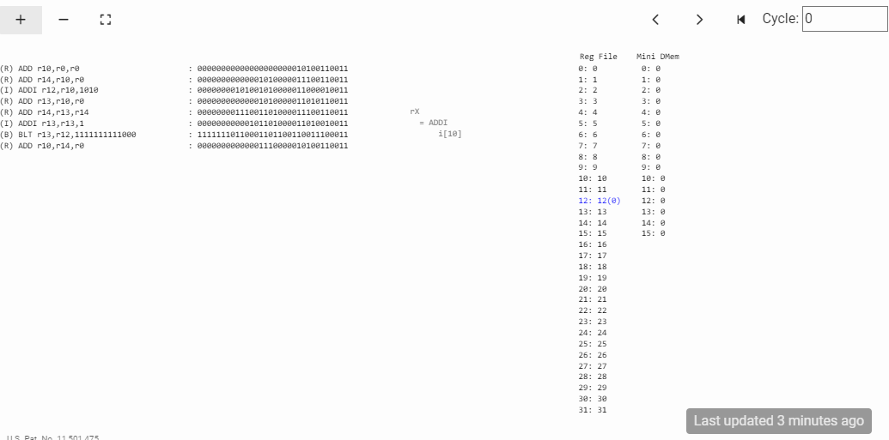   

3) Waveform  
   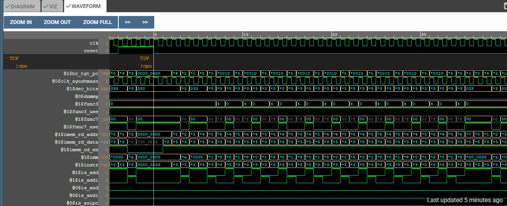  

4) Diagram
   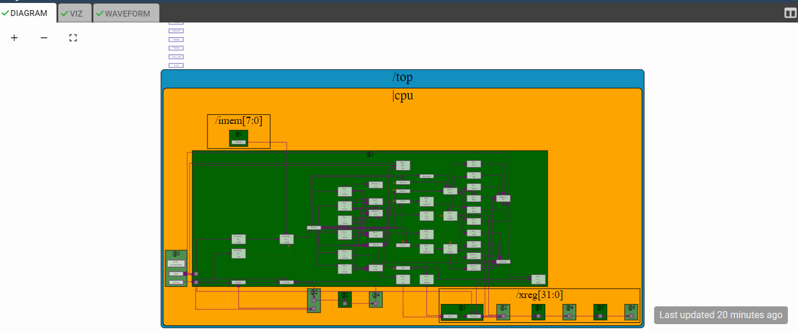  

   Sum 1 to 9  
   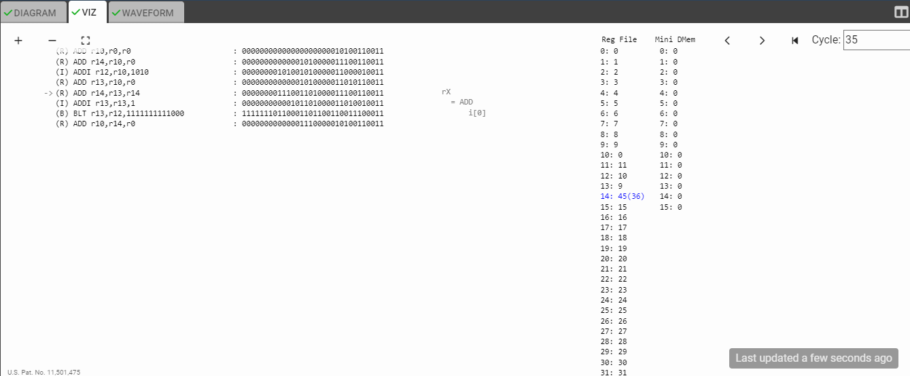 


## Complete Pipelined RISC-V CPU micro-architecture  

### Valid Signal  
We use following code to find valid signal for program counter  
``` 
$start = >>1$reset && !$reset;    
$valid = $reset ? 1'b0 : ($start || >>3$valid);
```
For a new valid branch signal we type   
 ```
 $valid_taken_br = $valid && $taken_branch;
```
Incorporate this into program counter  
```
$pc[31:0] = >>1$reset ? 1'b0 : >>3$valid_taken_branch ? >>3$br_tgt_pc : >>1$pc + 32'd4;
```
## Branch target path  
Here we are defining $valid, $valid_load and $valid_jump and are incorporating it in $valid in stage 1.  

```
$valid = !(>>1$valid_taken_branch || >>2$valid_taken_branch || >>1$valid_load || >>2$valid_load 
                    || >>1$valid_jump || >>2$valid_jump) ;
                    
         $valid_load = $valid && $is_load ;
         $valid_jump = $valid && $is_load;      
```

We'll add following instructions too  
```
$is_load = $dec_bits ==? 11'bx_xxx_0000011;
         $is_sb = $dec_bits ==? 11'bx_000_0100011;
         $is_sh = $dec_bits ==? 11'bx_001_0100011;
         $is_sw = $dec_bits ==? 11'bx_010_0100011;
         $is_slti = $dec_bits ==?11'bx_010_0010011;
         $is_sltiu = $dec_bits ==?11'bx_011_0010011;
         $is_xori = $dec_bits ==? 11'bx_100_0010011;
         $is_ori = $dec_bits ==? 11'bx_110_0010011;
         $is_andi = $dec_bits ==? 11'bx_111_0010011;
         $is_slli = $dec_bits ==? 11'b0_001_0010011;
         $is_srli = $dec_bits ==? 11'b0_101_0010011;
         $is_srai = $dec_bits ==? 11'b1_101_0010011;
         $is_sub = $dec_bits ==? 11'b1_000_0110011;
         $is_sll = $dec_bits ==? 11'b0_001_0110011;
         $is_slt = $dec_bits ==? 11'b0_010_0110011;
         $is_sltu = $dec_bits ==? 11'b0_011_0110011;
         $is_xor = $dec_bits ==? 11'b0_100_0110011;
         $is_srl = $dec_bits ==? 11'b0_101_0110011;
         $is_sra = $dec_bits ==? 11'b1_101_0110011;
         $is_or = $dec_bits ==? 11'b0_110_0110011;
         $is_and = $dec_bits ==? 11'b0_111_0110011;
         $is_lui = $dec_bits ==? 11'bx_xxx_0110111;
         $is_auipc = $dec_bits ==? 11'bx_xxx_0010111;
         $is_jal = $dec_bits ==? 11'bx_xxx_1101111;
         $is_jalr = $dec_bits ==? 11'bx_000_1100111;
         $is_jump = $is_jal || $is_jalr ;
```   

## Update register read  
The code for updating register read is  
```
$rf_rd_en1 = $rs1_use && >>2$result;
         $rf_rd_index1[4:0] = $rs1;
         $rf_rd_en2 = $rs2_use && >>2$result;
         $rf_rd_index2[4:0] = $rs2;
```

## Data Memory  
```
$dmem_wr_en = $is_s_instr && $valid ;
         $dmem_addr[3:0] = $result[5:2] ;
         $dmem_wr_data[31:0] = $src2_value ;
         $dmem_rd_en = $is_load ;
```

## Load data  
```
$ld_data[31:0] = $dmem_rd_data ;
```

## Adding instruction signals  
```
$result[31:0] = $is_addi ? $src1_value + $imm :
              $is_add ? $src1_value + $src2_value :
              $is_andi ? $src1_value & $imm :
              $is_ori  ? $src1_value | $imm :
              $is_xori ? $src1_value ^ $imm :
              $is_slli ? $src1_value << $imm[5:0] :
              $is_srli ? $src1_value >> $imm[5:0] :
              $is_and ? $src1_value & $src2_value :
              $is_or ? $src1_value | $src2_value :
              $is_xor ? $src1_value ^ $src2_value :
              $is_sub ? $src1_value - $src2_value :
              $is_sll ? $src1_value << $src2_value[4:0] :
              $is_srl ? $src1_value >> $src2_value[4:0] :
              $is_sltu ? $src1_value < $src2_value :
              $is_sltiu ? $src1_value < $imm :
              $is_lui ? {$imm[31:12], 12'b0} :
              $is_auipc ? $pc + $imm : 
              $is_jal ? $pc + 32'd4 :
              $is_jalr ? $pc + 32'd4 :
              $is_srai ? {{32{$src1_value[31]}}, $src1_value} >> $imm[4:0] :
              $is_slt ? ($src1_value[31] == $src2_value[31]) ? $sltu_rslt : {31'b0 $src1_value[31]} :
              $is_slti ? ($src1_value[31] == $imm[31]) ? $sltiu_rslt : {31'b0, $src1_value[31]} :
              $is_sra ? {{32{$src1_value[31]}}, $src1_value} >> $src2_value[4:0] :
              $is_load || $is_s_instr ? $src1_value + $imm :
              32'bx ;
      @3
         //Register File Write 
         
         $rf_wr_en = $rd_use && $rd != 5'b0 && $valid || >>2$valid_load;
         $rf_wr_index[4:0] = >>2$valid_load ? >>2$rd : $rd;
         $rf_wr_data[31:0] = >>2$valid_load ? >>2$ld_data :  $result;
         
         //Branch Instructions
         
         $taken_branch = $is_beq ? ($src1_value == $src2_value):
                         $is_bne ? ($src1_value != $src2_value):
                         $is_blt ? (($src1_value < $src2_value)^($src1_value[31] != $src2_value[31])):
                         $is_bge ? (($src1_value >= $src2_value)^($src1_value[31] != $src2_value[31])):
                         $is_bltu ? ($src1_value < $src2_value):
                         $is_bgeu ? ($src1_value >= $src2_value):
                                    1'b0;

```

#### It is advised to change the MACROS again  
```
|cpu
      m4+imem(@1)    // Args: (read stage)
      m4+rf(@2, @3)  // Args: (read stage, write stage) - if equal, no register bypass is required
      m4+dmem(@4)    // Args: (read/write stage)

   m4+cpu_viz(@4)    // For visualisation, argument should be at least equal to the last stage of CPU logic. @4 would work for all labs.
```

Diagram   
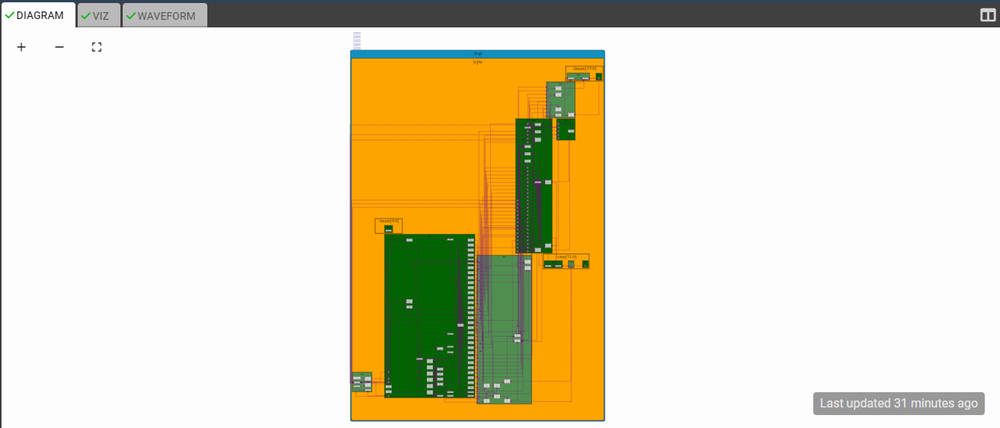 

### Waveforms  

Waveform containing reset signal and clk_ayushmaan    
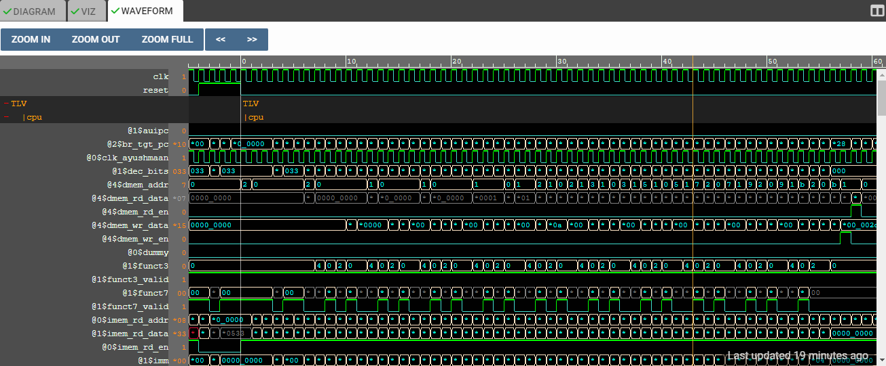   

Waveform containing xreg14  
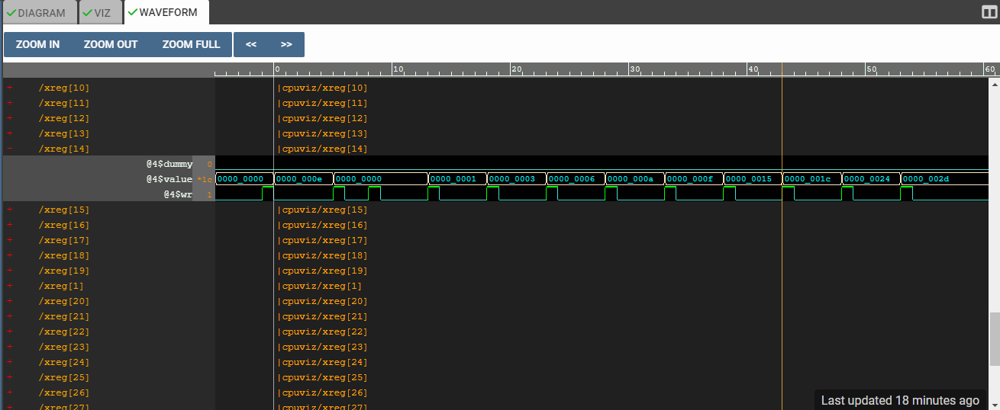 


<a name="Lab7"></a>  
# Lab 7 - Risc V CPU tlv code to verilog code conversion  
In the Lab 7, we'll be performing the following steps sequentially  
1) Install python3
2) Creating a virtual environment with python
3) Downloading sandpiper-saas module  
4) Creating testbench and simulating the verilog code  

First execute the following command on linux terminal which'll install python3  
```
sudo apt install make python python3 python3-pip git iverilog gtkwave python3-venv
```   

Before we go ahead and convert our tlv code to verilog, we will first create a virtual environment. It'll help us in using additional python libraries. Otherwise we would have to needed to download them in our system.  
Use this command for   
```
python -m venv .venv 
```  
Now install sandpiper-saas module using   
```
pip3 install sandpiper-saas
```    
Now this library will convert our tlv code to verilog code. Type  
```
sandpiper-saas -i ./tlv_code/RiscV_CPU.tlv -o RiscV_CPU.v --bestsv --noline -p verilog --outdir ./src/module/
```  

#### Creating testbench    
We have to write a testbench to simulate our verilog code. Then type following command to compile verilog code.   
```
iverilog -o output/RiscV_CPU.out src/module/RiscV_CPU_tb.v -I src/include -I src/module 
```    

After the verilog code gets compiled execute the out file to obtain the .vcd file to observe the waveforms using gtkwave  
```
./RV_CPU.out
gtkwave RV_CPU_tb.vcd 
```  
#### Simulation Results     
Waveform containing reset signal and clk_ayushmaan  
    

Waveform containing xreg14  
   

GTK Waveform  
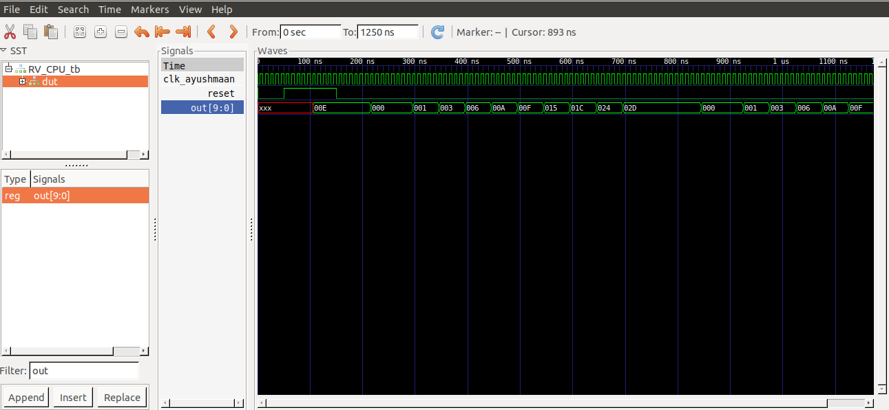    

<a name="Lab8"></a>
# Lab 8 - BabySoc Simulation   
In Lab 8, we'll first install following in linux 
1) iverilog
2) gtkwave
3) yosys
4) opensta  

For installing iverilog, use the command  
```
    sudo apt-get install iverilog
```
Afterwards to verify whether it has installed or not, type verilog and you'll get the output as shown in the figure    
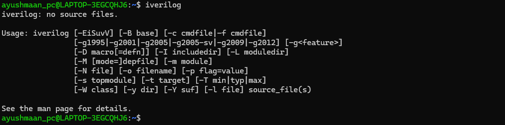   

For installing gtkwave, use the following command  
```
    sudo apt update
    sudo apt install gtkwave
```  
Now to verify your installation, type gtkwave and you'll get output as shown in both the figures below  
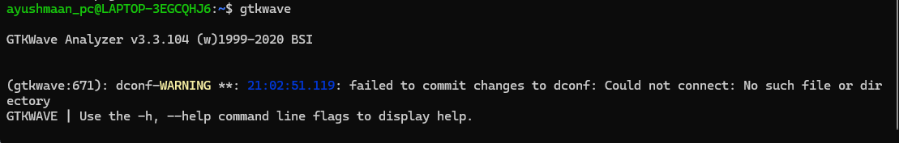 
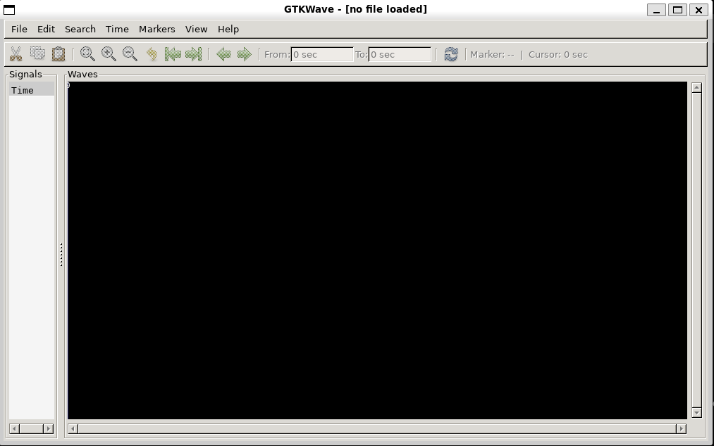   

For installing Yosys, use following commands  
```
    $ git clone https://github.com/YosysHQ/yosys.git
    $ cd yosys
    $ sudo apt install make (If make is not installed) 
    $ sudo apt-get install build-essential clang bison flex \
        libreadline-dev gawk tcl-dev libffi-dev git \
        graphviz xdot pkg-config python3 libboost-system-dev \
        libboost-python-dev libboost-filesystem-dev zlib1g-dev
    $ make config-gcc
    $ make 
    $ sudo make install
```  

To verify your installation, type yosys in terminal and you'll get the following output  
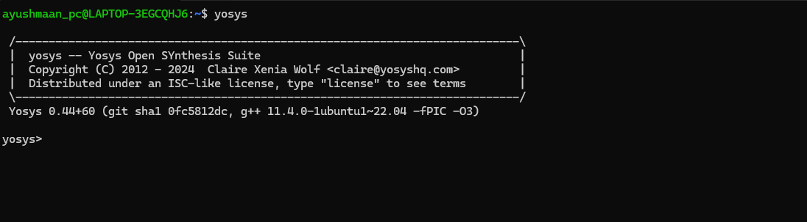   

For installing Open STA, refer to this github repository  
https://github.com/The-OpenROAD-Project/OpenSTA  

### BabySoc Simulation  
Lets have a look over the IPs PLL and DAC.   
#### PLL  
A Phase-Locked Loop (PLL) is an electronic system that aligns the phase and frequency of its output signal with a given reference signal. It typically includes three core elements: a phase comparator that detects discrepancies between the reference and output phases, a loop filter that refines the error signal to enhance stability and reduce noise, and a voltage-controlled oscillator (VCO) that modifies its frequency in response to the filtered error, ensuring phase alignment. PLLs are commonly employed in tasks like clock generation, frequency synthesis, and data recovery in communication systems.  

#### DAC  
A Digital-to-Analog Converter (DAC) is an electronic component that transforms digital signals, often in binary form, into corresponding analog signals, such as voltage or current. This conversion is essential for enabling digital data to be processed by analog devices or for producing outputs that humans can perceive, such as sound or images. DACs are widely used in applications like audio playback, video rendering, and various signal processing tasks.  

#### Required files  
* src/module - contains all RTL files and testbench.v used for simulating our BabySoC design.  
* src/include - contains RTL files used in `include define in main RTL files in src/module.  

Please note that the above files except the RiscV_CPU.v have been taken from the below reference repo,  
 https://github.com/Subhasis-Sahu/BabySoC_Simulation  

#### Functional simulation  
* iverilog -o output/RiscV_CPU.out src/module/RiscV_CPU_tb.v -I src/include -I src/module  
* ./RiscV_CPU.out    
* gtkwave dump.out      
The below screenshot shows the output of sum 1 to 9
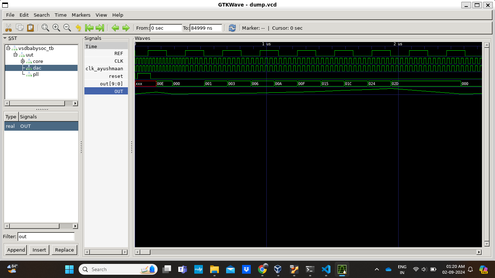<br>


Here,

*    REF is the input clk reference signal to the PLL module.         
*    CLK is the output clk signal from the PLL module.        
*    clk_ayushmaan is the clock used by the RISC-V CPU for the operations.
*    reset is the reset signal for the RISC-V CPU.        
*    out is the ouput signal from the RISC-V CPU. Here we can observe the sum value from 1 to 9 over multiple clock cycles.        
*    OUT is the DAC output signal.     

In the below figure, i have zoom out the gtkwave output to see the wave  
<br>

<a name="Lab9"></a>
# Lab 9 - RTL Design using Verilog and SKY130 Technology       
## Day 1  


A simulator is a tool that checks if the RTL design meets specifications by running simulations. For our lab, we used Iverilog to do this. The simulator observes any changes in the input signals and calculates the output based on those changes; if the inputs remain the same, it won’t evaluate the output. The design consists of the actual Verilog code or a collection of codes that provide the intended functionality according to the required specifications. Additionally, a testbench is set up to introduce test conditions to the design, ensuring it works as expected.  

### Setup for testbench and design  
The design under test (DUT) is instantiated within the testbench, taking its ports into account. The testbench creates the necessary stimulus using Verilog code, but it does not include any input or output ports.  

 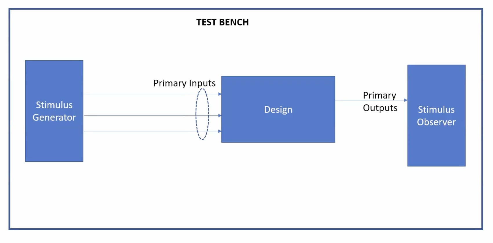


### Simulation based on iVerilog  
In the iVerilog simulation flow, you supply the actual design code along with its testbench to iVerilog. The tool looks for the stimulus in the testbench and applies it to the design. The simulator produces a 'vcd' file, which stands for 'Value Change Dump,' as its output. To analyze the waveforms in this dump file, we use GTKWave to verify the design's functionality.  

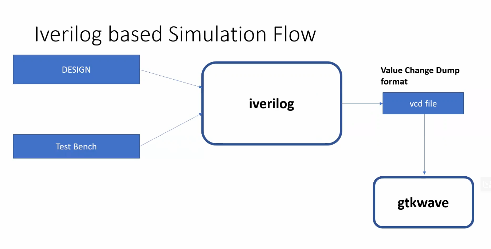  

### File setup for Lab  
Use following commands to Clone the skywater130RTLDes repository  
```
mkdir VLSI   
cd VLSI   
git clone https://github.com/kunalg123/sky130RTLDesignAndSynthesisWorkshop.git   
```
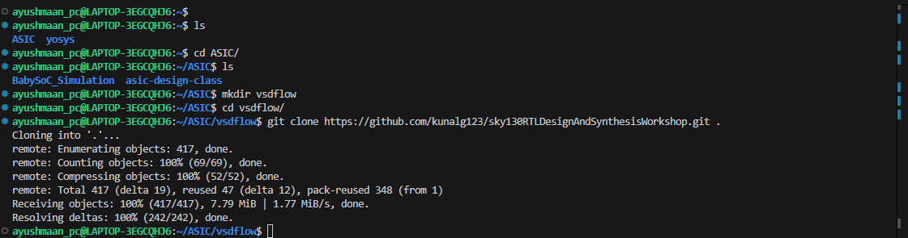     

The My_Lib folder holds the necessary files for the labs. Specifically, the verilog_files folder includes all the design files and testbenches that will be used. The snapshot below shows the files available in the verilog_files folder  

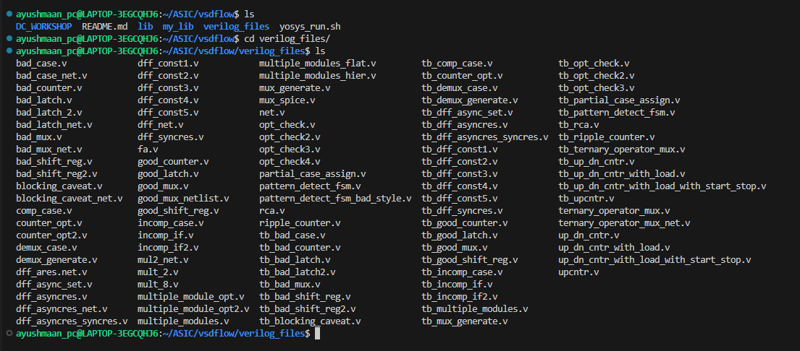


### Introduction to verilog and gtkwave  
In this lab, we will explore how to use the Iverilog simulator for a 2x1 multiplexer (MUX). We start with the MUX design and its testbench, both located in the verilog_files folder. To simulate the design with the testbench, we use the command 'iverilog good_mux.v tb_good_mux.v'. The snapshot below includes the commands for running the simulation, generating the dump file, and viewing it.    
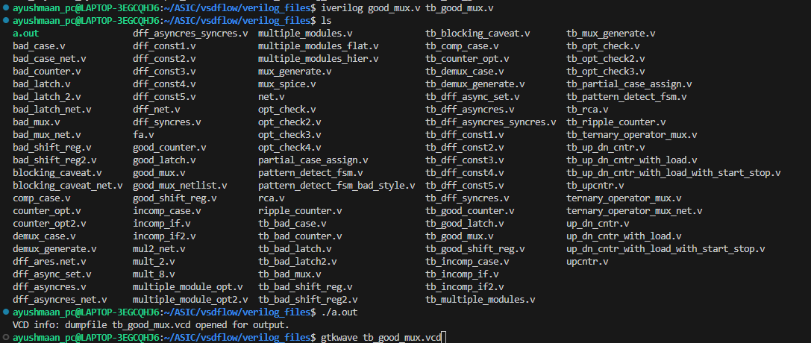  
Following is the gtkwave output  
   

### Introduction to Yosys and Synthesis  
#### Synthesis and Synthesizer  
Synthesis is the process of converting an RTL behavioral design into a gate-level netlist.
A synthesizer is the tool that transforms the RTL design into a netlist. In our course, we use Yosys as the synthesizer.

The image below illustrates the synthesis flow.  
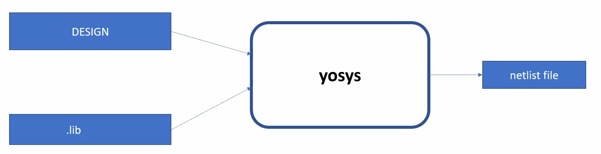

The .lib or Front End Library contains a set of logical modules, including basic gates like AND, OR, and NOT, with various input counts and speeds. Different gate speeds are needed to meet setup and hold time requirements.

It’s often necessary to guide the synthesizer in selecting the right gate sizes for implementing the logic. Using too many fast cells can lead to hold time violations and negatively affect power and area. Conversely, using too many slow cells can make the circuit sluggish and fail to meet design requirements. This guidance is typically provided to the synthesizer as constraints.  
### RTL to netlist conversion using Yosys  
Use the following commands  
```
read_liberty -lib lib/sky130_fd_sc_hd__tt_025C_1v80.lib  
read_verilog verilog_files/good_mux.v  
synth -top good_mux  
```
We'll see the following output  
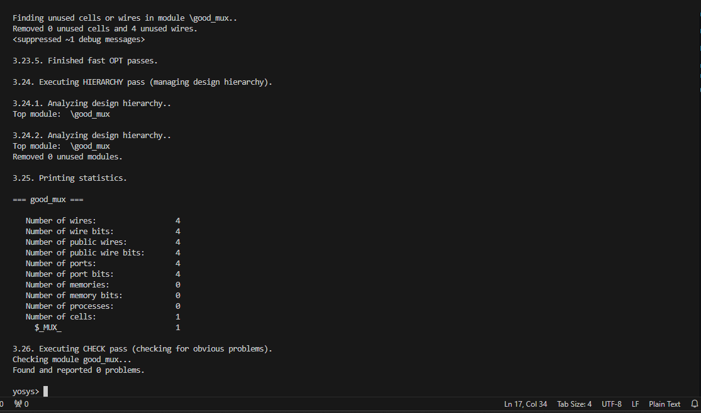  

Use the following command to get the netlist  
```
abc -liberty lib/sky130_fd_sc_hd__tt_025C_1v80.lib  
```
We'll see the following output    
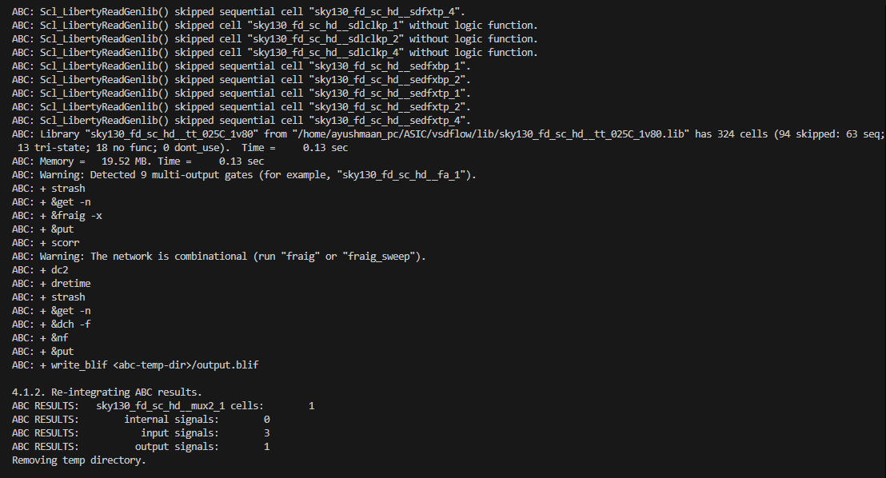  
To see the graphical output, use  
```
show
```  
We'll see this output     
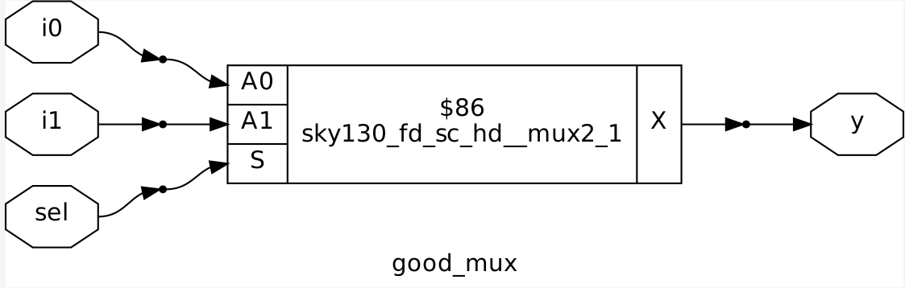   

Dump the verilog code using  
```
write_verilog -noattr verilog_files/good_mux_netlist.v
```  
Here's the netlist generated for 2:1 MUX  
```  
/* Generated by Yosys 0.44+60 (git sha1 0fc5812dc, g++ 11.4.0-1ubuntu1~22.04 -fPIC -O3) */  

module good_mux(i0, i1, sel, y);  
  wire _0_;  
  wire _1_;  
  wire _2_;  
  wire _3_;  
  input i0;  
  wire i0;  
  input i1;  
  wire i1;  
  input sel;  
  wire sel;  
  output y;  
  wire y;  
  sky130_fd_sc_hd__mux2_1 _4_ (  
    .A0(_0_),  
    .A1(_1_),  
    .S(_2_),  
    .X(_3_)  
  );  
  assign _0_ = i0;  
  assign _1_ = i1;  
  assign _2_ = sel;  
  assign y = _3_;  
endmodule  
```     

## Day 2  
### Timing libs, hierarchical vs flat synthesis, efficient flop coding styles   
The name of the library file is sky130_fd_sc_hd__tt_025C_1v80  
* sky130 - Process name
* fd - skywater foundary
* sc - digital standard cells
* hd - high density
* tt - typical
* 025C - temperature (in Celcius)
* 1v80 - voltage    
Any library will include information about several key factors. First, the process outlines the characteristics of the chip being designed using that specific library, accounting for variations in fabrication. Second, the voltage aspect describes how the silicon behaves with changes in voltage. Lastly, the temperature section specifies the optimal temperature at which the library is defined.     
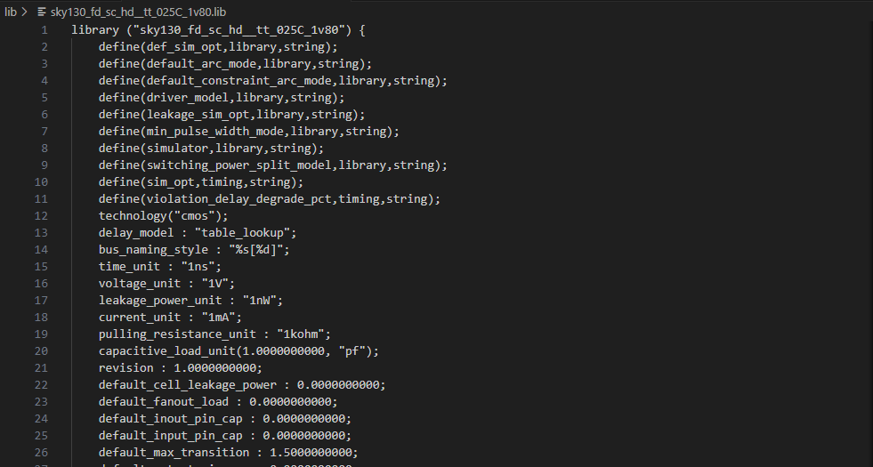    

### Hierarchical Synthesis vs Flat Synthesis  
Use the following codes to get the graphical design for the case of hierarchical design  
```
read_liberty -lib ../sky130RTLDesignAndSynthesisWorkshop/lib/sky130_fd_sc_hd__tt_025C_1v80.lib  
read_verilog multiple_modules.v  
synth -top multiple_module.v  
abc -liberty ./my_lib/lib/sky130_fd_sc_hd_tt_025C_1v80.  
show multiple_module  
```  
We'll get the following output    
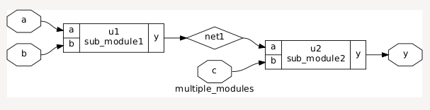   
Get the netlist for this design using following command  
```
write_verilog -noattr verilog_files/multiple_modules_hier.v
```  
The Flat synthesis merges all hierarchical modules present in the design into a single module to create a flat netlist.  
Use following commands  
```
flatten
```
For netlist do
```
write_verilog
```   
Here we'll get the flattened synthesis   
 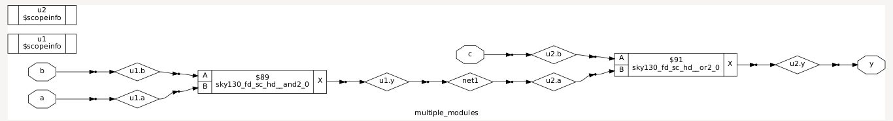   
 From the netlist, we observe that the AND and OR gates are directly instantiated, meaning the hierarchy has been lost.

Sub-module level synthesis is done when the same sub-module is repeated multiple times in the design. In such cases, we synthesize that sub-module once and replicate it wherever needed.

For larger designs, we use a divide and conquer approach. This involves synthesizing sub-modules one at a time in a series, as running synthesis on the entire design at once may not be efficient, and the tool might not perform optimally.      
### Flop Coding Styles and Optimizations   
Flops are essential in combinational circuits because the output can change after a propagation delay, leading to glitches. To mitigate these glitches, flops serve as storage elements that stabilize the output. Additionally, flops require initialization, which is facilitated by control pins for setting and resetting. There are various coding styles for flops: asynchronous reset sets the output (Q) to 0 when the reset signal is activated; asynchronous set sets Q to 1 when the set signal is activated; synchronous reset sets Q to 0 upon the clock signal if a reset signal is present; and synchronous set sets Q to 1 when the clock signal occurs, provided a set signal is active beforehand.  
#### Results for different design  
For Asychronous Reset Design, use  
```
iverilog dff_asyncres.v tb_dff_asyncres.v
./a.out  
gtkwave tb_dff_async_set.vcd  
```  
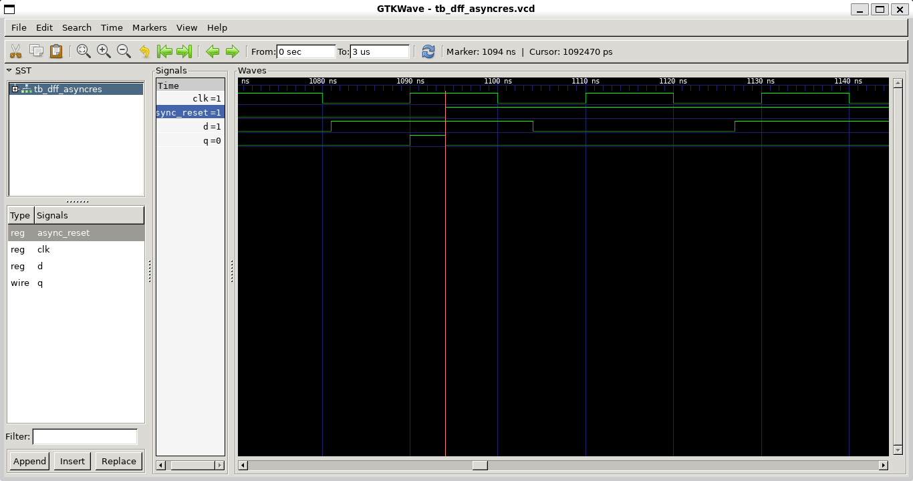  

Asychronous Set Design, use the previous commands only but change the name  
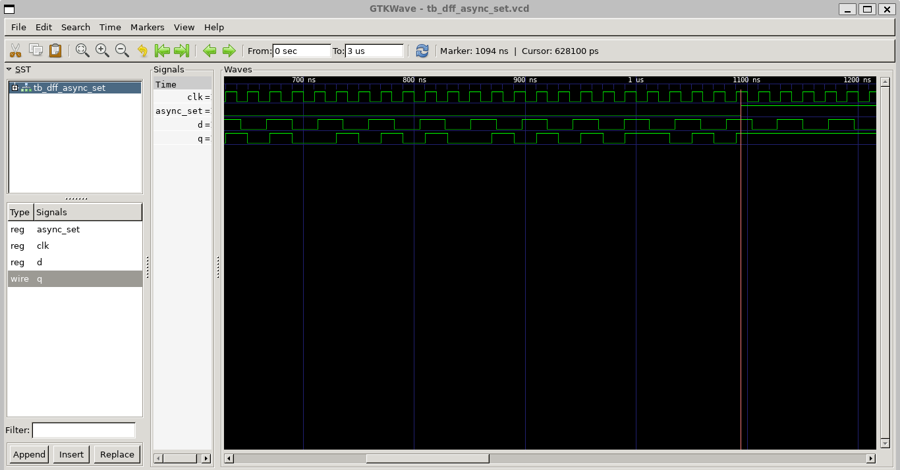   

Synchronous Reset Design  
  


#### Synthsizing the designs  
For Asynchronous Reset, use the commands  
```
 yosys
read_liberty -lib ../lib/sky130_fd_sc_hd__tt_025C_1v80.lib
read_verilog dff_asyncres.v
synth -top dff_asyncres
dfflibmap -liberty ../lib/sky130_fd_sc_hd__tt_025C_1v80.lib
show
write_verilog -noattr dff_asyncres_netlist.v
gvim dff_asyncres_netlist.v
```
This will also generaste the netlist  
Here i am attaching the snapshot for graqphical synthesis  
For the furthur designs just use the same code but change the name    
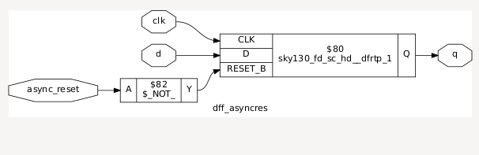    

Asynchronous Set  
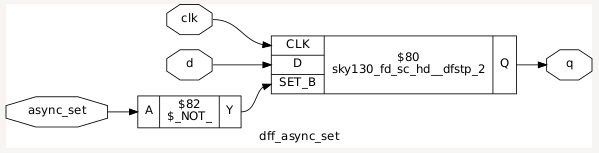  

Synchronous Reset
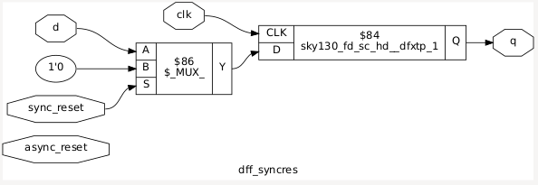  

Multiplication by 2 -  
In this tutorial, we learn that specific hardware for multiplication is not needed to multiply a number by 2. Instead, this can be easily done by adding a zero to the least significant bit (LSB) of the number, effectively concatenating it with a zero.  

  
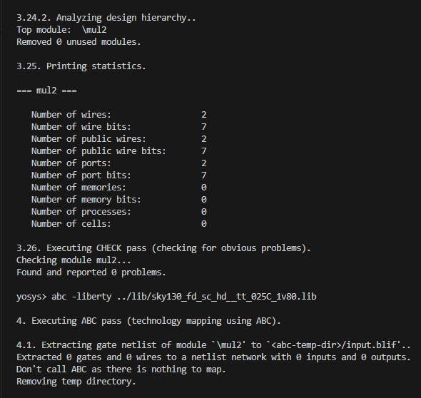  

## Day 3  
### Combinational and Sequential Optimization  
Combinational Logic Optimization involves refining the logic design to achieve the most efficient outcome in terms of area and power savings. Several techniques are used for optimization, including:

Constant Propagation: This technique involves replacing variables with constant values to simplify the logic.
Boolean Logic Optimization: This focuses on applying Boolean algebra to reduce the complexity of the logic expressions.
Sequential Logic Optimization: This refers to techniques aimed at enhancing sequential circuits.
Techniques:
Basic:

Sequential Constant Propagation: This involves using constant values in sequential logic to streamline the design.
Advanced:

State Optimization: This technique optimizes the states in sequential circuits to minimize unnecessary states.
Retiming: This process involves rearranging the registers in a circuit to improve performance without altering its functionality.
Sequential Logic Cloning: This technique creates copies of certain sequential elements to enhance circuit efficiency and reduce delays.  

### Optimization on different opt_check.v files   
#### opt_check.v  
Run the Yosys flow in the same way as in the previous labs.  
Then run the following command  
```
opt_clean -purge  
```  
Link it to the liberty file using the abc command.  
Here i am attaching the screenshots for all the designs.  

opt_check.v    
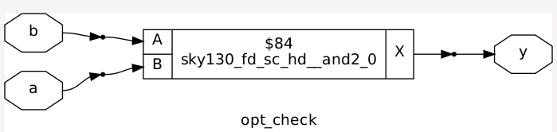  

opt_check2.v  
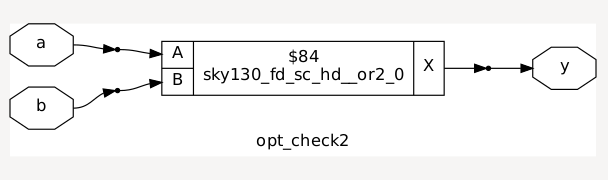  

opt_check3.v  
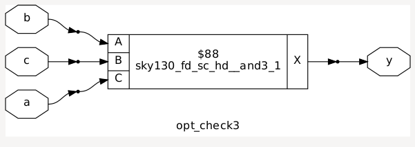  

opt_check4.v  
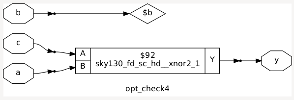  

### Sequential Optimizations  
dff_const1.v  
To verify the working in iverilog and gtkwave, use the following commands  
```
iverilog verilog_files/dff_const1.v verilog_files/tb_dff_const1.v
./a.out
gtkwave tb_dff_const1.vcd
```  
Do the same for all the files  
I have attached the screenshots for all   
dff_const1.v
  
dff_const2.v  
  
dff_const3.v  
  
dff_const4.v   
  

#### Synthesizing the design using Yosys for dff_const1.v  
Use the dfflibmap switch and follow the previous yosys command  
I am attaching the outputs  
dff_const1.v
  
dff_const2.v  
  
dff_const3.v  
  
dff_const4.v   

dff_const5.v   
  

### Sequential Optimization Unused Output    
Unused Output Optimization involves strategies and techniques designed to reduce or eliminate unnecessary or redundant outputs in processes, systems, or designs. This concept is applicable in various fields, such as software development, manufacturing, energy management, and data processing  
#### Synthesis of counter_opt.v 
Attaching snapshots of synthesis report and graphical representation of the synthesized design  

 

#### Synthesis of counter_opt2.v 
Attaching snapshots of synthesis report and graphical representation of the synthesized design  

    

## Day 4  
### GLS, Blocking v/s Non-Blocking and Synthesis-Simulation Mismatch  
GLS, or Gate-Level Simulation, involves running a testbench using a netlist as the design under test (DUT). The netlist is logically equivalent to the RTL code, meaning the same testbench can be used with both designs. The purpose of GLS is to verify the logical correctness of the design after synthesis and to ensure that timing requirements are met; for this, GLS must be executed with delay annotations. If the gate-level models include these delay annotations, GLS can be used for timing validation. There can be several reasons for mismatches between synthesis and simulation, such as a missing sensitivity list, differences between blocking and non-blocking assignments, and non-standard Verilog coding practices. 
  

#### ternary_operator_mux.v  
Here I have attached the screenshots of  
1) behaviour design using iverilog and gtkwave  
2) synthesis report  
3) graphical representation of the synthesized design  
4) simulation of the generated netlist with the same testbench    


  

#### good_mux.v  


  

#### bad_mux.v  


   

#### blocking_caveat.v    


<a name="Lab10"></a>
# Lab 10 - Synthesizing RISC-V using Yosys and post synthesis  BabySoc Simulation  
We will be synthesizing the RISC-V core that we designed earlier in Verilog HDL.  
Use the following commands
```
read_liberty -lib lib/sky130_fd_sc_hd__tt_025C_1v80.lib
read_verilog -I src/include/ -I src/module/ src/module/clk_gate.v src/module/RiscV_CPU.v
synth -v RV_CPU
dfflibmap -liberty lib/sky130_fd_sc_hd__tt_025C_1v80.lib
abc -liberty lib/sky130_fd_sc_hd__tt_025C_1v80.lib
write_verilog -noattr src/module/RV_CPU_netlist.v
```
Snapshot of Synthesis output    
  

Once we generate the netlist, we will conduct a gate-level simulation using the BabySoC model.

The BabySoC model will include the gate-level synthesized CPU core, DAC module, and PLL module.

Below are the commands for compiling with iVerilog and visualizing the waveform using GTKWave    
```
iverilog -DFUNCTIONAL -DUNIT_DELAY=#1 -DPOST_SYNTH_SIM src/module/RiscV_CPU_tb.v -I src/module/ -I src/include/ -I lib/verilog_model/
./a.out  
gtkwave post_synth_sim.vcd
```  
Snapshot of waveform obtained on gtkwave  

  

Zoomed-in snapshot  

  


Now when we compare the above two snapshots with pre synthesis waveform, we'll learn that the results are same.

Snapshot of simulation before synthesis.  
<br>  

Snapshot of standard cell implemented in the synthesized verilog file    
  

Snapshot of signal of standard cell  
    

<a name="Lab11"></a>    

# Lab 11 - STA for Synthesized Risc-V Core with OpenSTA  

### Static time analysis  
Static Timing Analysis (STA) verifies the timing performance of a digital circuit without dynamic simulation, checking if it meets timing constraints by analyzing timing paths. STA evaluates paths from input to output, considering delays of gates and interconnects. It checks for setup and hold time violations, ensuring data stability before and after clock edges. STA also incorporates clock definitions, including frequency and variations like skew or jitter, and assumes worst-case conditions for delays to ensure circuit performance under all conditions. Tools like Synopsys PrimeTime and Cadence Tempus automate this process, identifying timing issues early to ensure reliable circuit operation at intended speeds. STA is crucial for several reasons in digital circuit design. It verifies that data signals can propagate within required time limits, ensuring stable and valid outputs. It helps identify timing violations, ensuring reliable operation of flip-flops and sequential elements. STA allows designers to optimize performance by identifying and improving critical paths that limit the circuit's maximum operating frequency. It enables early detection of timing issues, reducing costly revisions later. STA also helps balance performance and power efficiency by analyzing the impact of clock frequency on power consumption. Automated STA tools efficiently analyze complex designs, incorporating variations in manufacturing, temperature, and voltage to ensure robust performance.  

### Reg2Reg Path   
A reg2reg path connects two sequential elements, like flip-flops, in a digital circuit. This path is essential in STA for verifying data flow from one register to another through combinational logic. Reg2reg paths ensure proper data flow and synchronization, especially in designs with pipelining or sequential operations. They are analyzed for setup and hold time constraints, ensuring data stability at the registers. Timing analysis includes delays through combinational logic connecting the registers. Critical reg2reg paths limit the circuit's maximum operating frequency, requiring optimization. If registers belong to different clock domains, additional considerations for metastability and synchronization are needed.  

### Clk2Reg Path    
A clk2reg path connects the clock signal to a register in a digital circuit, ensuring the register operates correctly in response to clock events. This path represents the time it takes for the clock signal to reach the register from the clock source, including delays from clock buffers or routing. In setup timing analysis, it determines when data must arrive at the register relative to the clock edge. Clock delay through distribution elements impacts the timing of data capture at the register. While primarily for setup time analysis, clk2reg paths also consider hold time, especially with clock jitter or variations. Analysis includes considerations for synchronization in different clock domains.   

### STA for synthesized Risc-V core using time period of 9.3 seconds  
In this task, we'll generate setup and hold timing reports for our synthesized RISC-V Core module. These reports are essential for verifying that the circuit meets its timing constraints, ensuring data signals propagate correctly through the core  
Constraints provided to STA tool as a sdc file to generate timing reports    
```
set_units -time ns

create_clock [get_pins {pll/CLK}] -name clk -period 9.3
set_clock_uncertainty [expr 0.05 * 9.3] -setup [get_clocks clk]
set_clock_uncertainty [expr 0.08 * 9.3] -hold [get_clocks clk]
set_clock_transition [expr 0.05 * 9.3] [get_clocks clk]
set_input_transition [expr 0.08 * 9.3] [all_inputs]
```
The clock period for our synthesized RISC-V Core module is specified as 9.3 ns. Key parameters for timing analysis include setup uncertainty at 5% of the clock period, which equates to 0.5175 ns, and the same value is set for clock transition time. Hold uncertainty is defined as 8%, amounting to 0.828 ns, with the input data transition also at 8%, or 0.828 ns. These precise settings are critical to ensure accurate setup and hold timing reports, verifying that the core meets its timing constraints for reliable operation.    
Run the following command to execute the OpenSTA 
```
sta scripts/sta.conf  
```   
Contents of the sta.conf file,  
```
read_liberty -min ./lib/sta/sky130_fd_sc_hd__tt_025C_1v80.lib
read_liberty -max ./lib/sta/sky130_fd_sc_hd__tt_025C_1v80.lib
read_liberty -min ./lib/avsdpll.lib
read_liberty -max ./lib/avsdpll.lib
read_liberty -min ./lib/avsddac.lib
read_liberty -max ./lib/avsddac.lib
read_verilog ./src/module/vsdbabysoc_synth.v
link_design vsdbabysoc
read_sdc ./src/sdc/sta_post_synth.sdc
```


Snapshots of reports  
Reg2Reg max path    
  
   

Reg2Reg min path   

  

<a name="Lab12"></a>
# Lab 12 - PVT Corner Analysis using OpenSTA  
Constraint files contents -  
```
set_units -time ns
set PERIOD 9.3
create_clock [get_pins {pll/CLK}] -name clk -period $PERIOD
set_clock_uncertainty [expr 0.05 * $PERIOD] -setup [get_clocks clk]
set_clock_uncertainty [expr 0.08 * $PERIOD] -hold [get_clocks clk]
set_clock_transition [expr 0.05 * $PERIOD] [get_clocks clk]


set_input_transition [expr $PERIOD * 0.08] [get_ports ENB_CP]
set_input_transition [expr $PERIOD * 0.08] [get_ports ENB_VCO]
set_input_transition [expr $PERIOD * 0.08] [get_ports REF]
set_input_transition [expr $PERIOD * 0.08] [get_ports VCO_IN]
set_input_transition [expr $PERIOD * 0.08] [get_ports VREFH]
```  

Contents of tickle script for automating STA procedure  
```

set list_of_lib_files(1) "sky130_fd_sc_hd__ff_100C_1v65.lib"
set list_of_lib_files(2) "sky130_fd_sc_hd__ff_100C_1v95.lib"
set list_of_lib_files(3) "sky130_fd_sc_hd__ff_n40C_1v56.lib"
set list_of_lib_files(4) "sky130_fd_sc_hd__ff_n40C_1v65.lib"
set list_of_lib_files(5) "sky130_fd_sc_hd__ff_n40C_1v76.lib"
set list_of_lib_files(6) "sky130_fd_sc_hd__ff_n40C_1v95.lib"
set list_of_lib_files(7) "sky130_fd_sc_hd__ss_100C_1v40.lib"
set list_of_lib_files(8) "sky130_fd_sc_hd__ss_100C_1v60.lib"
set list_of_lib_files(9) "sky130_fd_sc_hd__ss_n40C_1v28.lib"
set list_of_lib_files(10) "sky130_fd_sc_hd__ss_n40C_1v35.lib"
set list_of_lib_files(11) "sky130_fd_sc_hd__ss_n40C_1v40.lib"
set list_of_lib_files(12) "sky130_fd_sc_hd__ss_n40C_1v44.lib"
set list_of_lib_files(13) "sky130_fd_sc_hd__ss_n40C_1v60.lib"
set list_of_lib_files(14) "sky130_fd_sc_hd__ss_n40C_1v76.lib"
set list_of_lib_files(15) "sky130_fd_sc_hd__tt_025C_1v80.lib"
set list_of_lib_files(16) "sky130_fd_sc_hd__tt_100C_1v80.lib"

for {set i 1} {$i <= [array size list_of_lib_files]} {incr i} {
read_liberty -min ./lib/timing/$list_of_lib_files($i)
read_liberty -max ./lib/timing/$list_of_lib_files($i)
read_liberty -min ./lib/avsdpll.lib
read_liberty -max ./lib/avsdpll.lib
read_liberty -min ./lib/avsddac.lib
read_liberty -max ./lib/avsddac.lib
read_verilog ./src/module/vsdbabysoc_synth.v
link_design vsdbabysoc
current_design
read_sdc ./src/sdc/sta_post_synth.sdc
check_setup -verbose
report_checks -path_delay min_max -fields {nets cap slew input_pins fanout} -digits {4} > ./output/sta_output/min_max_$list_of_lib_files($i).txt

exec echo "$list_of_lib_files($i)" >> ./output/sta_output/sta_worst_max_slack.txt
report_worst_slack -max -digits {4} >> ./output/sta_output/sta_worst_max_slack.txt

exec echo "$list_of_lib_files($i)" >> ./output/sta_output/sta_worst_min_slack.txt
report_worst_slack -min -digits {4} >> ./output/sta_output/sta_worst_min_slack.txt

exec echo "$list_of_lib_files($i)" >> ./output/sta_output/sta_tns.txt
report_tns -digits {4} >> ./output/sta_output/sta_tns.txt

exec echo "$list_of_lib_files($i)" >> ./output/sta_output/sta_wns.txt
report_wns -digits {4} >> ./output/sta_output/sta_wns.txt
}
```    
## Output for different library files  

<table border="1" class="dataframe">
  <thead>
    <tr style="text-align: right;">
      <th>Library File</th>
      <th>Total Negative Slack (TNS)</th>
      <th>Worst Negative Slack (WNS)</th>
      <th>Worst Setup Slack (Worst Slack)</th>
      <th>Worst Hold Slack (Worst Slack)</th>
    </tr>
  </thead>
  <tbody>
    <tr>
      <th>sky130_fd_sc_hd__ff_100C_1v65.lib</th>
      <td>0.0000</td>
      <td>0.0000</td>
      <td>0.2111</td>
      <td>-0.4626</td>
    </tr>
    <tr>
      <th>sky130_fd_sc_hd__ff_100C_1v95.lib</th>
      <td>0.0000</td>
      <td>0.0000</td>
      <td>2.5674</td>
      <td>-0.5208</td>
    </tr>
    <tr>
      <th>sky130_fd_sc_hd__ff_n40C_1v56.lib</th>
      <td>-1193.3677</td>
      <td>-4.4555</td>
      <td>-4.4555</td>
      <td>-0.4029</td>
    </tr>
    <tr>
      <th>sky130_fd_sc_hd__ff_n40C_1v65.lib</th>
      <td>-108.6873</td>
      <td>-2.0103</td>
      <td>-2.0103</td>
      <td>-0.4425</td>
    </tr>
    <tr>
      <th>sky130_fd_sc_hd__ff_n40C_1v76.lib</th>
      <td>-0.0201</td>
      <td>-0.0101</td>
      <td>-0.0101</td>
      <td>-0.4776</td>
    </tr>
    <tr>
      <th>sky130_fd_sc_hd__ff_n40C_1v95.lib</th>
      <td>0.0000</td>
      <td>0.0000</td>
      <td>2.0716</td>
      <td>-0.5198</td>
    </tr>
    <tr>
      <th>sky130_fd_sc_hd__ss_100C_1v40.lib</th>
      <td>-17688.2051</td>
      <td>-24.8781</td>
      <td>-24.8781</td>
      <td>0.2628</td>
    </tr>
    <tr>
      <th>sky130_fd_sc_hd__ss_100C_1v60.lib</th>
      <td>-9087.0791</td>
      <td>-13.5343</td>
      <td>-13.5343</td>
      <td>-0.0131</td>
    </tr>
    <tr>
      <th>sky130_fd_sc_hd__ss_n40C_1v28.lib</th>
      <td>-80471.7031</td>
      <td>-117.1601</td>
      <td>-117.1601</td>
      <td>1.1634</td>
    </tr>
    <tr>
      <th>sky130_fd_sc_hd__ss_n40C_1v35.lib</th>
      <td>-50354.4688</td>
      <td>-72.0574</td>
      <td>-72.0574</td>
      <td>0.6975</td>
    </tr>
    <tr>
      <th>sky130_fd_sc_hd__ss_n40C_1v40.lib</th>
      <td>-38594.0156</td>
      <td>-54.5613</td>
      <td>-54.5613</td>
      <td>0.4748</td>
    </tr>
    <tr>
      <th>sky130_fd_sc_hd__ss_n40C_1v44.lib</th>
      <td>-32623.3867</td>
      <td>-45.9168</td>
      <td>-45.9168</td>
      <td>0.3375</td>
    </tr>
    <tr>
      <th>sky130_fd_sc_hd__ss_n40C_1v60.lib</th>
      <td>-15937.9834</td>
      <td>-22.9076</td>
      <td>-22.9076</td>
      <td>0.0082</td>
    </tr>
    <tr>
      <th>sky130_fd_sc_hd__ss_n40C_1v76.lib</th>
      <td>-9395.4395</td>
      <td>-13.9140</td>
      <td>-13.9140</td>
      <td>-0.2038</td>
    </tr>
    <tr>
      <th>sky130_fd_sc_hd__tt_025C_1v80.lib</th>
      <td>-411.7515</td>
      <td>-2.7791</td>
      <td>-2.7791</td>
      <td>-0.4003</td>
    </tr>
    <tr>
      <th>sky130_fd_sc_hd__tt_100C_1v80.lib</th>
      <td>-121.4369</td>
      <td>-1.9982</td>
      <td>-1.9982</td>
      <td>-0.4020</td>
    </tr>
  </tbody>
</table>  

## Graph of worst negative slack    
  

## Graph of worst hold slack  
   

## Graph of total negative slack measured    
   

## Graph of Worst negative slack  measured  
    

<a name="Lab13"></a>
# Lab 13 - Physical Design using Openlane  

## Day 1

### Introduction    
With the advent of open-source technology for chip design, numerous RTL designs and EDA tools became freely accessible. The [SKY130 PDK] fills a crucial role in the open-source chip development ecosystem, provided by Skywater Technologies and Google (https://skywater-pdk.readthedocs.io/en/latest/rules.html). A variety of EDA tools with unique functions existed at different stages of the design process, but the design flow remained unclear, and the Skywater PDK was only compatible with proprietary equipment. These issues were resolved by OpenLane (https://github.com/The-OpenROAD-Project/OpenLane), which delivers a fully automated and streamlined RTL to GDSII flow. OpenLane is not a standalone product but a workflow consisting of several EDA tools, automation scripts, and the Skywater PDK, all optimized for integration with open-source EDA tools.  

### Overall design flow  
An RTL design is generated based on a design specification using hardware description languages (HDLs) like Verilog or VHDL, or through high-level synthesis tools such as SystemC, MATLAB HDL Coder, Bluespec, and others. Once the RTL netlist is created, the process of turning it into a manufactured integrated circuit (IC) begins, which is referred to as the Physical Design Flow. The first step in this flow is floor planning, which involves the placement of pre-existing cells, power planning, and other foundational tasks. Next, logical synthesis placement is carried out. To minimize clock skew and keep it within acceptable limits, Clock Tree Synthesis (CTS) is performed. After CTS, the various components are routed. Throughout the entire physical design flow—from logic synthesis to routing—Static Timing Analysis (STA) is employed at each stage to check the design's integrity and ensure it meets timing requirements. Magic, an open-source tool, is used to visualize the layout at every stage. It also allows users to extract small netlists, run SPICE simulations, and compare the results with post-layout simulations using ngspice. The physical design process begins with floor planning (cell placement, power planning, etc.) and continues with placement.      


    

### OpenLane Flow  

#### 1. Synthesis  
The RTL Level Design is synthesized using Yosys, an open-source logic synthesizer, which converts the RTL Netlist into a synthesized netlist with details about standard cells and their implementations. Yosys uses the RTL design, timing libraries, and Verilog models of standard cells for this process, while abc handles technology mapping to SkyWater-PDK variants. Synthesis strategies can be optimized for minimal area or optimal timing, with a synthesis exploration utility generating reports on delays, timing, and area. The design exploration utility tailors the design configuration, providing reports with various metrics for optimal selection and is also used for regression testing. Optionally, Design For Test (DFT) insertion, carried out by Fault, tests the design to ensure its functionality and reliability.  

#### 2. Floor Planning and Power Planning  
The OpenROAD flow handles this process by placing macros and IPs in the core during the pre-placement phase. Macro floor planning, which places macros closer to inputs, outputs, or other macros with more connections, is done separately. Decoupling capacitors are added to maintain logic states within the noise margin and prevent loading effects. To address voltage droop at Vdd and ground bounce at Vss, which can push logic states out of the noise margin, Vdd and Vss are distributed as horizontal and vertical strips across the chip, ensuring blocks can access power from the nearest source.  

#### 3. Placement  
Placement in chip design involves two main steps to ensure the required logic is optimally positioned. First, Global Placement finds the best position for each cell, though these positions may not be entirely accurate and can result in overlaps. Then, Detailed Placement makes minimal adjustments to resolve any issues from the global placement, ensuring all cells are correctly placed without overlap. This method ensures that the logic is correctly and optimally positioned within the design.  

#### 4. Clock Tree Synthesis  
To ensure minimum skew the Clock is routed optimally through the circuit using different algorithms. This is done in the OpenROAD flow. This is done by TritonCTS.  

#### 5. Fake Antenna and diode swapping  
During fabrication, long wires can act as antennas, accumulating charges that may damage transistors. To mitigate this, bridging passes the wire through different layers or an antenna diode cell is added to discharge accumulated charges. In the OpenLane approach, fake diodes are inserted at every cell input during placement, matching the antenna diode's footprint. If violations are detected by the Antenna Checker, the fake diode is replaced with a real one. Conversely, the OpenROAD approach addresses antenna violations automatically during the global routing step by inserting antenna diodes. OpenLane provides the flexibility to choose either method.  

#### 6. Routing  
This step involves implementing the interconnect using the various metal layers specified in the PDK. It includes two phases:

Global Routing: Conducted within the OpenROAD flow using FastRoute.

Detailed Routing: Carried out with TritonRoute outside the OpenROAD flow following global routing. Before this step, Yosys performs a Logic Equivalence Check to ensure that the optimizations by OpenROAD have not altered the circuit's functionality.   

#### 7. RC Extraction  
From the .def file, the parasitic extraction is done to generate the .spef file (Standard Prasitic Exchange Format) which produces an accurate analog model of the circuit by including the parasitic effects due to wires, parasitic capacitances, etc.  

#### 8. STA  
At this stage again OpenSTA is used to perform the Static Timing Analysis.  

#### 9. Sign-off Steps  
Design Rule Check (DRC) is performed by Magic

Layout Versus Schematic (LVS) is performed by Netgen
 
#### 10. GDSII Extraction   
The routed .def file is used my Magic to generate the GDSII file   

### Execution of 'picorv32a' using OpenLane flow   

To start the openlane, go to openlane directory and open terminal  
```
make mount
```

The terminal changes into the docker instance. Open the OpenLane in interactive mode.  
```
./flow.tcl -interactive
```  

Set the package required by OpenLane  
```
package require openlane 0.9
```  

#### Synthesis  
Run the synthesis  
```
run_synthesis
```    

   

     

To view the netlist  
```
cd designs/picorv32a/runs/11-11_19-02/results/synthesis/
gedit picorv32a.synthesis.v
```
OpenLane invokes the following   
* Yosys - RTL Synthesis and maps to yosys generic cells   

* abc - Technology mapping with the Skywater130 PDK. Here sky130_fd_sc_hd Skywater Foundry produced High density standard cells are used.  

* OpenSTA - This does the Static Timing Analysis on the netlist generated after synthesis and generated the timing reports  

  

#### Key Concepts  
Flops ratio    

* The flop ratio is defined as the ratio of the number of flops to the total number of cells  
* Here flop ratio is 1613/14876 = 0.108 (i.e: 10.8%) [From the synthesis statistics]        

## Day 2  
### Chip Floor Planning Consideration  
#### Utilisation Factor   
* The ratio of area occupied by the cells in the netlist to the total area of the core.  
* Best practice is to set the utilisation factor less than 50% so that there will be space for optimisations, routing, inserting buffers etc  

#### Aspect Ratio  
* Aspect ratio is the ratio of height to the width of the die.
* Aspect Ratio of 1 indicates that the die is a square die.  

#### Floorplanning   
Floorplanning involves the following stages    

#### Pre-Placed cells    
When dealing with complex logic repeated multiple times or a third-party design, it can be perceived as an abstract black box with input/output ports and clocks. These modules are categorized as either macros or IPs. 

**Macros** are modules like CPU cores developed by the entity fabricating the chip. **IPs (Intellectual Property)** are packages obtained from third parties or pre-packaged Hard IPs developed by the same entity, such as SRAM, PLL, and protocol converters. Initially, these macros and IPs are placed in the core before placing standard cells and planning power distribution. They are strategically positioned to ensure that highly connected cells are placed nearby and oriented for efficient input and output connections.   

#### Decoupling Capacitors to the pre placed cells    
Power lines can have RLC components, causing voltage drops at the node where they enter the blocks or the cell ground to be at a higher potential than the ideal 0V. This can lead to logic transitions falling into forbidden states, causing circuit misbehavior. To prevent this, a capacitor is added in parallel with the power and ground nodes of the block. This capacitor decouples the block from the power source during logic transitions, maintaining the integrity of the circuit's operation.  

#### Power Planning   
When multiple cells or blocks draw power from the same power rail and sink power to the same ground pin, several effects can occur. A logic transition from 1 to 0 in numerous cells simultaneously can lead to a **Voltage Droop**, where the voltage drops from Vdd in the power lines. Conversely, a transition from 0 to 1 in many cells at once can cause the ground potential to rise above 0V, known as a **Ground Bump**. These effects risk pushing the logic state out of the specified noise margin. To mitigate this, Vdd and Gnd are arranged in a grid of horizontal and vertical tracks, allowing cells near an intersection to tap power from Vdd or sink power to Gnd, maintaining stable logic states.    

#### Pin Placement  
* The input, output and Clock pins are placed optimally such that there is less complication in routing or optimised delay  
* There are different styles of pin placement in openlane like random pin placement , uniformly spaced etc   

### Floorplan run on OpenLANE & review layout in Magic  
** Floorplan envrionment variables or switches: **  
FP_CORE_UTIL - core utilization percentage  
FP_ASPECT_RATIO - the cores aspect ratio  
FP_CORE_MARGIN - The length of the margin surrounding the core area   
FP_IO_MODE - defines pin configurations around the core(1 = randomly equidistant/0 = not equidistant)
FP_CORE_VMETAL - vertical metal layer where I/O pins are placed   
FP_CORE_HMETAL - horizontal metal layer where I/O pins are placed   

Note: Usually, the parameter values for vertical metal layer and horizontal metal layer will be 1 more than that specified in the files    
  
  Importance files in increasing priority order:

floorplan.tcl - System default settings
config.tcl
sky130A_sky130_fd_sc_hd_config.tcl
To run the picorv32a floorplan in openLANE:  
```
run_floorplan  

```   
Post the floorplan run, a .def file will have been created within the results/floorplan directory. We may review floorplan files by checking the floorplan.tcl. The system defaults will have been overriden by switches set in conifg.tcl and further overriden by switches set in sky130A_sky130_fd_sc_hd_config.tcl.

To view the floorplan, Magic is invoked after moving to the results/floorplan directory:  
```
magic -T /home/vsduser/Desktop/work/tools/openlane_working_dir/pdks/sky130A/libs.tech/magic/sky130A.tech lef read ../../tmp/merged.lef def read picorv32a.floorplan.def

```    

   

Zoomed in 
  

Floorplaning DEF  
       

According to floorplan def 1000 Unit Distance = 1 micron Die width in unit distance

= 660685 − 0

= 660685 Die height in unit distance = 671405 − 0

= 671405 Distance in microns

= Value in unit distance / 1000 Die width in microns

= 660685/1000 = 660.685 microns Die height in microns

= 671405/1000 = 671.405 microns Are os die in microns

= 660.685 ∗ 671.405 = 443587.212425 square microns

Power Planing DEF    
  


### Library Binding and Placement    

  

#### Netlist Binding and initial place design   
First we need to bind the netlist with physical cells. We have shapes for OR, AND and every cell for pratice purpose. But in reality we dont have such shapes, we have give an physical dimensions like rectangles or squares weight and width. This information is given in libs and lefs. Now we place these cells in our design by initilaising it.   

#### Optimize Placement  
The next step is placement. Once we initial the design, the logic cells in netlist in its physical dimisoins is placed on the floorplan. Placement is perfomed in 2 stages:

Global Placement: Cells will be placed randomly in optimal positions which may not be legal and cells may overlap. Optimization is done through reduction of half parameter wire length. Detailed Placement: It alters the position of cells post global placement so as to legalise them. Legalisation of cells is important from timing point of view.

Optimization is stage where we estimate the lenght and capictance, based on that we add buffers. Ideally, Optimization is done for better timing.    

#### Congestion aware Placement    
Congestion-aware placement refers to the process of positioning cells on the chip layout while considering potential routing congestion. The goal is to place cells in such a way that the interconnects (wires) connecting them can be routed efficiently, without excessive overlap or interference that could lead to design rule violations, signal delays, or even physical errors.

#### Need for libraries and characterization  
As we know, From logic synthesis to routing and STA, each and evry stage has one thing in common i.e., logic gates/ logic cells. In order for the tool understand these gates are and their timing, we need to characterize these cells.   

#### Cell Design and characterization flows  
Library is a place where we get information about every cell. It has differents cells with different size, functionality,threshold voltages. There is a typical cell design flow steps.

1. Inputs : PDKS(process design kit) : DRC & LVS, SPICE Models, library & user-defined specs.  
2. Design Steps :Circuit design, Layout design (Art of layout Euler's path and stick diagram), Extraction of parasitics, Characterization (timing, noise, power).  
3. Outputs: CDL (circuit description language), LEF, GDSII, extracted SPICE netlist (.cir), timing, noise and power .lib files  
  
 #### Timing aware placement

Timing-aware placement focuses on ensuring that the cells are placed in a way that optimizes the chip’s timing performance. The objective is to minimize the delay along critical signal paths (often referred to as critical paths) to meet the required timing constraints (setup and hold times).
Command  
```
# Congestion aware placement by default
run_placement
```  
Opening the DEF file  
```
# path containing generated placement def
cd Desktop/work/tools/openlane_working_dir/openlane/designs/picorv32a/runs/<your_path>/results/placement/

# Command to load the placement def in magic tool
magic -T /home/vsduser/Desktop/work/tools/openlane_working_dir/pdks/sky130A/libs.tech/magic/sky130A.tech lef read ../../tmp/merged.lef def read picorv32a.placement.def &
```

    
Legalized placement of standard cells

we can see the power rails for standard cells as well as the legalized placed standard cells


 


#### Standard Cell Characterization Flow  
In the industry, a standard cell characterization flow typically involves several key steps:

1. **Read in the models and tech files**.
2. **Read extracted SPICE Netlist**.
3. **Recognize the behavior of the cells**.
4. **Read the subcircuits**.
5. **Attach power sources**.
6. **Apply stimulus to the characterization setup**.
7. **Provide necessary output capacitance loads**.
8. **Provide necessary simulation commands**.

These steps are combined into a configuration file and processed by characterization software called **GUNA**, which generates timing, noise, and power models. The resulting .lib files are categorized into **timing characterization**, **power characterization**, and **noise characterization**.    

  

#### Timing threshold definitions   
| Timing Definition     | Value       |
|-----------------------|-------------|
| slew_low_rise_thr     | 20% value   |
| slew_high_rise_thr    | 80% value   |
| slew_low_fall_thr     | 20% value   |
| slew_high_fall_thr    | 80% value   |
| in_rise_thr           | 50% value   |
| in_fall_thr           | 50% value   |
| out_rise_thr          | 50% value   |
| out_fall_thr          | 50% value   |

#### Propagation Delay and Transition Time   
Propagation Delay The time difference between when the transitional input reaches 50% of its final value and when the output reaches 50% of its final value. Poor choice of threshold values lead to negative delay values. Even thought you have taken good threshold values, sometimes depending upon how good or bad the slew, the dealy might be still +ve or -ve.

```
Propagation delay = time(out_thr) - time(in_thr)
```

##### Transition Time   

The time it takes the signal to move between states is the transition time , where the time is measured between 10% and 90% or 20% to 80% of the signal levels.  
```
Rise transition time = time(slew_high_rise_thr) - time (slew_low_rise_thr)

Low transition time = time(slew_high_fall_thr) - time (slew_low_fall_thr)
```   


## Day 3  
### Introduction to VSD Inverter and Layout Visualization using Magic Tool    
```
git clone https://github.com/nickson-jose/vsdstdcelldesign.git
cd vsdstdcelldesign
cp /home/vsduser/Desktop/work/tools/openlane_working_dir/pdks/sky130A/libs.tech/magic/sky130A.tech .
magic -T sky130A.tech sky130_ayushmaan_inv.mag &
```  
Below screenshot shows the layout of the inverter,    
 


Follow the below commands in the magic tool tkcon window to extract the custom inverter layout into spice netlist,   
```
pwd
extract all
ext2spice cthresh 0 rthresh 0
ext2spice
```   
Below screenshot shows the extracted spice parameters, SPICE3 file created from sky130_ayushmaan_inv.ext - technology: sky130A
```
.option scale=10m
 
.subckt sky130_ayushmaan_inv A Y VPWR VGND
X0 Y A VGND VGND sky130_fd_pr__nfet_01v8 ad=1.72n pd=0.166m as=1.64n ps=0.162m w=42 l=23
X1 Y A VPWR VPWR sky130_fd_pr__pfet_01v8 ad=1.64n pd=0.162m as=1.72n ps=0.166m w=42 l=23
C0 VPWR Y 0.117f
C1 A Y 0.0749f
C2 A VPWR 0.0779f
C3 Y VGND 0.277f
C4 A VGND 0.434f
C5 VPWR VGND 0.774f
.ends
```  

#### SPICE Deck Creation and Simulation for CMOS inverter    
A SPICE deck encompasses crucial information such as the model description, netlist description, component connectivity, component values, capacitance load, nodes, simulation type and parameters, and included libraries. Before running a SPICE simulation, it's necessary to create this deck, which provides specific details. These include component connectivity, such as the connections for Vdd, Vss, Vin, and the substrate, which tunes the MOS threshold voltage; component values, including those for PMOS and NMOS, output load, input gate voltage, and supply voltage; node identification; simulation commands; and the model file, which contains parameters for NMOS and PMOS specific to the technology used. This detailed setup ensures accurate and reliable simulation results.   
   
From the waveform we can see the characteristics are maintained across all sizes of CMOS. So CMOS as a circuit is a robust device hence use in designing of logic gates. Parameters that define the robustness of the CMOS are.  
   
Through transient analysis, we calculate the rise and fall delays of the CMOS by SPICE Simulation. As we know delays are calculated at 50% of the final values.   

#### Lab steps to git clone vsdstdcelldesign  
* First, clone the required mag files and spicemodels of inverter,pmos and nmos sky130. The command to clone files from github link is  
```
git clone https://github.com/nickson-jose/vsdstdcelldesign.git
```   

#### Switching Threshold Vm
The Switching Threshold of a CMOS inverter is the point where the Vin = Vout on the DC Transfer characreristics.
At this point, both the transistors are in saturation region, means both are turned on and have high chances of current flowing driectly from VDD to Ground called Leakage current.  

### Inception of Layout and CMOS Fabrication Process  
#### Mask CMOS Fabrication  
The 16-mask CMOS fabrication process involves several critical steps to create integrated circuits. First, the appropriate semiconductor substrate is selected. Active regions for transistors are isolated by depositing SiO2 and Si3N4 layers, followed by photolithography and silicon nitride etching, a process known as LOCOS. Si3N4 is then removed with hot phosphoric acid. N-well and P-well regions are formed separately using photolithography and ion implantation with Boron for P-wells and Phosphorus for N-wells, followed by high-temperature diffusion to establish well depths. Gates, crucial for controlling transistor switching, are created using polysilicon layers and photolithography. Lightly Doped Drain (LDD) regions are formed to mitigate hot electron and short channel effects. Source and drain formation involves adding thin oxide layers and performing N+ and P+ implants. Local interconnects are formed by etching thin screen oxide, depositing titanium, and heat treatment to produce low-resistant titanium silicon dioxide and titanium nitride. Higher-level metal formation addresses non-planar surface topography using Chemical Mechanical Polishing (CMP) with doped silicon oxide, TiN, tungsten, and aluminum layers. Finally, a dielectric layer, typically Si3N4, is applied to protect the chip, resulting in advanced integrated circuits essential for modern electronics.    
       

### Complete SPICE Deck for Inverter    
Here we go into the created spice file and make changes to it and simulate.
In the spicefile the nmos and pmos model details were defined along with the sub circuit details and the other parasitic capacitance information also.

We are going to be doing a transient analysis so we make the following changes to it.

* VGND to VSS 0V  
* Supply voltage VPWR to GND.  
* Sweeping a pulse input.  
* We add library files and change the scale to 0.01u   
* Add a transient analysis with nessasary stoptime and precision as shown below.    
   


Following is the command to execute the Spice deck using the Ngspice software   
```
ngspice spice_files/sky130_ayushmaan_inv.spice
```   
Following commmand is to see the waveform for the transient analysis,  
```
ngpsice spice_files/sky130_ayushmaan_inv.spice  
```    
   

Following commmand is to see the waveform for the transient analysis,  
```
ngpsice spice_files/sky130_ayushmaan_inv.spice
```    

   

Inverter Standard Cell Characterization
There are four timing parameters used to characterize the inverter standard cell:

1. Rise transition - Time taken for the output to rise from 20% to 80% of max value  
2. Fall Transition: Time taken for the output to fall from 80% to 20% of max value  
3. Cell Rise delay: difference in time (50% output rise) to time(50% input fall)  
4. Cell Fall delay: difference in time (50% output fall) to time (50% input rise)      


### LAB exercise and DRC Challenges  

#### Introduction of Magic and Skywater DRC's
Here the following are done:

In-depth overview of Magic DRC engine  
Introduction to Google/Skywater DRC rules  
Lab to warm up : Fixing a simple rule error   
Lab of main excersise : Fixing or creating a complex error   
To know anything about magic use the following link:  
```
http://opencircuitdesign.com/magic/
```
Majorly check out magic tutorails and magic command summary in the Using magic tab.
Also do check out the technlogy file manual in the technology files tab.   

#### Sky130s pdk intro and Steps to download labs  
To view the documentation of Skywater pdks use the link below:  
```
https://skywater-pdk.readthedocs.io/en/main/  
```  
We can view the rules associated with it there.  

We are downloading the packaged files to our local pc using the wget command. It stands for Web get . The following command is used.  
```
wget http://opencircuitdesign.com/open_pdks/archive/drc_tests.tgz  
```  
After this, extract it using the below command.  
```
 tar xfz drc_tests.tgz  
 ```  
 Once it is done. A drc_test folder is created in the directory which extraction is done.
cd to that folder and run Magic.For better graphic use, the command below is used:  
```
magic -d XR  
```   
To load a mag file we can load it using File > Open > .mag from the magic window.    
   

Or we can use the terminal comand:  
```
magic -d XR <filename>.mag  
```
Select a particular block to check the DRC check. using drc why .
We will use the following command in the tkcon window to see metal cut down.  
```
cif see VIA2  
```    
  

Load Sky130 tech rules for drc challenges
First load the poly file by load poly.mag on tkcon window.

Finding the error by mouse cursor and find the box area, Poly.9 is violated due to spacing between polyres and poly.    

   

We find that distance between regular polysilicon & poly resistor should be 22um but it is showing 17um and still no errors . We should go to sky130A.tech file and modify as follows to detect this error.  

In line  
```
spacing npres *nsd 480 touching_illegal \
	"poly.resistor spacing to N-tap < %d (poly.9)"
```  
change to  
```
spacing npres allpolynonres 480 touching_illegal \
	"poly.resistor spacing to N-tap < %d (poly.9)"
```  
Also,  
```
spacing xhrpoly,uhrpoly,xpc alldiff 480 touching_illegal \

	"xhrpoly/uhrpoly resistor spacing to diffusion < %d (poly.9)"
```   
change to  
```
spacing xhrpoly,uhrpoly,xpc allpolynonres 480 touching_illegal \

	"xhrpoly/uhrpoly resistor spacing to diffusion < %d (poly.9)"

```     


## Day 4  
### Pre-layout timing analysis and importance of good clock tree   
#### Grid into track info      
Track is a path on which metal layers are drawn for routing.It is used to define the height of the standard cell.

Guidelines to be followed while making a standard cell:

Input and output ports must lie on the intersection on Horizontal annd vertical tracks.
Width of standard cell must be in the odd multiple of track pitch & Height in the odd multiple of track height pitch.
The information to get the grids is defined in tracks.info. cd to the particular location and open the file.      
```
cd Desktop/work/tools/openlane_working_dir/pdks/open_pdks/sky130/openlane/sky130_fd_sc_hd/tracks.info
```   

The content of the file are:   
```
li1 X 0.23 0.46  //0.46um is the width  
li1 Y 0.17 0.34  //0.34um is the height 
met1 X 0.17 0.34
met1 Y 0.17 0.34
met2 X 0.23 0.46
met2 Y 0.23 0.46
met3 X 0.34 0.68
met3 Y 0.34 0.68
met4 X 0.46 0.92
met4 Y 0.46 0.92
met5 X 1.70 3.40
met5 Y 1.70 3.40  
```  
    
We input the below command in the tkcon window to get grid on magic.    

```
grid 0.46um 0.34um 0.23um 0.17um  
```    
   
 
 ####  Conversion of magic layout to standard cell LEF file   
Extraction of the LEF file for the cell comes next when the layout is completed. To help the placer and router tool, specific characteristics and definitions must be defined for the cell's pins. Ports are the macro's declared PINs, and in LEF files, a cell containing ports is written as a macro cell. Our goal is to extract LEF in a predetermined format from a configuration (in this case, a straightforward CMOS inverter). The first step is to define each port and assign the appropriate class and use characteristics to each port.  
Below are steps to define a port :  
First, open the.mag file for the design in the Magic Layout window. Next, select Edit >> Text to bring up a dialogue window. Use locali for port y & a, use metal 1 for vdd & gnd as shown in figures below.   
    
     
 
       
Define the purpose of ports as follows in tkcon window:    

```
port A class input
port A use signal

port Y class output
port Y use signal

port VPWR class inout
port VPWR use power

port VGND class inout
port VPWR use ground
```  
Generate lef file using following command   
```
lef write <name>  
```    
This generates sky130_ayushmaan_inv.lef file.  

#### Steps to include custom cell in ASIC design  
We have created a custom standard cell in previous steps of an inverter. Copy lef file, sky130_fd_sc_hd_typical.lib, sky130_fd_sc_hd_slow.lib & sky130_fd_sc_hd_fast.lib to src folder of picorv32a from libs folder vsdstdcelldesign.

Then modify the condif.tcl as follows.  
```

# Design
set ::env(DESIGN_NAME) "picorv32a"

set ::env(VERILOG_FILES) "$::env(DESIGN_DIR)/src/picorv32a.v"

set ::env(CLOCK_PORT) "clk"
set ::env(CLOCK_NET) $::env(CLOCK_PORT)

set ::env(GLB_RESIZER_TIMING_OPTIMIZATIONS) {1}

set ::env(LIB_SYNTH) "$::env(OPENLANE_ROOT)/designs/picorv32a/src/sky130_fd_sc_hd__typical.lib"
set ::env(LIB_SLOWEST) "$::env(OPENLANE_ROOT)/designs/picorv32a/src/sky130_fd_sc_hd__slow.lib"
set ::env(LIB_FASTEST) "$::env(OPENLANE_ROOT)/designs/picorv32a/src/sky130_fd_sc_hd__fast.lib"
set ::env(LIB_TYPICAL) "$::env(OPENLANE_ROOT)/designs/picorv32a/src/sky130_fd_sc_hd__typical.lib"

set ::env(EXTRA_LEFS) [glob $::env(OPENLANE_ROOT)/designs/$::env(DESIGN_NAME)/src/*.lef]

set filename $::env(DESIGN_DIR)/$::env(PDK)_$::env(STD_CELL_LIBRARY)_config.tcl
if { [file exists $filename] == 1} {
	source $filename
}
```   

To integrate standard cell in openlane flow, perform following commands:  
```
set lefs [glob $::env(DESIGN_DIR)/src/*.lef]
add_lefs -src $lefs
```  

Run openlane flow synthesis with newly inserted custom inverter cell   
```
docker
# Now that we have entered the OpenLANE flow contained docker sub-system we can invoke the OpenLANE flow in the Interactive mode using the following command
./flow.tcl -interactive

# Now that OpenLANE flow is open we have to input the required packages for proper functionality of the OpenLANE flow
package require openlane 0.9

# Now the OpenLANE flow is ready to run any design and initially we have to prep the design creating some necessary files and directories for running a specific design which in our case is 'picorv32a'
prep -design picorv32a

# Adiitional commands to include newly added lef to openlane flow
set lefs [glob $::env(DESIGN_DIR)/src/*.lef]
add_lefs -src $lefs

# Now that the design is prepped and ready, we can run synthesis using following command
run_synthesis
```    

  


#### Remove/reduce the newly introduced violations with the introduction of custom inverter cell by modifying design parameters  
Commands to view and change parameters to improve timing and run synthesis    
```
# Now once again we have to prep design so as to update variables
prep -design picorv32a -tag 14-11_19-09 -overwrite  

# Addiitional commands to include newly added lef to openlane flow merged.lef
set lefs [glob $::env(DESIGN_DIR)/src/*.lef]
add_lefs -src $lefs

# Command to display current value of variable SYNTH_STRATEGY
echo $::env(SYNTH_STRATEGY)

# Command to set new value for SYNTH_STRATEGY
set ::env(SYNTH_STRATEGY) "DELAY 3"

# Command to display current value of variable SYNTH_BUFFERING to check whether it's enabled
echo $::env(SYNTH_BUFFERING)

# Command to display current value of variable SYNTH_SIZING
echo $::env(SYNTH_SIZING)

# Command to set new value for SYNTH_SIZING
set ::env(SYNTH_SIZING) 1

# Command to display current value of variable SYNTH_DRIVING_CELL to check whether it's the proper cell or not
echo $::env(SYNTH_DRIVING_CELL)

# Now that the design is prepped and ready, we can run synthesis using following command
run_synthesis
```       
  


#### Run floorplan and placement and verify the cell is accepted in PnR flow     
Now that our custom inverter is properly accepted in synthesis we can now run floorplan using following command  
```
run_floorplan  
```   
  
Facing errors above, so need to run floorplan commands individually    

```
# Follwing commands are alltogather sourced in "run_floorplan" command
init_floorplan
place_io
tap_decap_or 
```    


Post floorplan, we need to execute the below command for placement  
```
run_placement  
```    


Commands to load placement def in magic in another terminal       

```
# Change directory to path containing generated placement def  
cd Desktop/work/tools/openlane_working_dir/openlane/designs/picorv32a/runs/14-11_19-09/results/placement/

# Command to load the placement def in magic tool
magic -T /home/vsduser/Desktop/work/tools/openlane_working_dir/pdks/sky130A/libs.tech/magic/sky130A.tech lef read ../../tmp/merged.lef def read picorv32a.placement.def &
```   
  
  

Command for tkcon window to view internal layers of cells
```
expand  
```    

  


### Post-Synthesis timing analysis with OpenSTA tool  
Since we are having 0 wns after improved timing run we are going to do timing analysis on initial run of synthesis which has lots of violations and no parameters were added to improve timing

Commands to invoke the OpenLANE flow include new lef and perform synthesis  
```
cd Desktop/work/tools/openlane_working_dir/openlane
docker

./flow.tcl -interactive

package require openlane 0.9

prep -design picorv32a

set lefs [glob $::env(DESIGN_DIR)/src/*.lef]
add_lefs -src $lefs

set ::env(SYNTH_SIZING) 1

run_synthesis
```        
 

Let's create .conf file for STA analysis,   
```
set_cmd_units -time ns -capacitance pF -current mA -voltage V -resistance kOhm -distance um
 
read_liberty -max /home/vsduser/Desktop/work/tools/openlane_working_dir/openlane/designs/picorv32a/src/sky130_fd_sc_hd__slow.lib
 
read_liberty -min /home/vsduser/Desktop/work/tools/openlane_working_dir/openlane/designs/picorv32a/src/sky130_fd_sc_hd__fast.lib
 
read_verilog /home/vsduser/Desktop/work/tools/openlane_working_dir/openlane/designs/picorv32a/runs/14-11_19-25/results/synthesis/picorv32a.synthesis.v
 
link_design picorv32a
 
read_sdc /home/vsduser/Desktop/work/tools/openlane_working_dir/openlane/designs/picorv32a/src/my_base.sdc
 
report_checks -path_delay min_max -fields {slew trans net cap input_pin}
report_tns
report_wns
```   


my_base.sdc     
  


Commands to run STA in another terminal  
```
cd Desktop/work/tools/openlane_working_dir/openlane
sta pre_sta.conf
```       
   
    


Since more fanout is causing more delay we can add parameter to reduce fanout and do synthesis again

Commands to include new lef and perform synthesis  
```
# Now the OpenLANE flow is ready to run any design and initially we have to prep the design creating some necessary files and directories for running a specific design which in our case is 'picorv32a'
prep -design picorv32a -tag 14-11_19-09 -overwrite

# Adiitional commands to include newly added lef to openlane flow
set lefs [glob $::env(DESIGN_DIR)/src/*.lef]
add_lefs -src $lefs

# Command to set new value for SYNTH_SIZING
set ::env(SYNTH_SIZING) 1

# Command to set new value for SYNTH_MAX_FANOUT
set ::env(SYNTH_MAX_FANOUT) 4

# Command to display current value of variable SYNTH_DRIVING_CELL to check whether it's the proper cell or not
echo $::env(SYNTH_DRIVING_CELL)

# Now that the design is prepped and ready, we can run synthesis using following command
run_synthesis
```    
  


Commands to run STA in another terminal 
```
# Change directory to openlane
cd Desktop/work/tools/openlane_working_dir/openlane

# Command to invoke OpenSTA tool with script
sta pre_sta.conf
```     
 
 

#### Make timing ECO fixes to remove all violations  
```
# Reports all the connections to a net
report_net -connections _13751_

# Checking command syntax
help replace_cell

# Replacing cell
replace_cell _17924_ sky130_fd_sc_hd__or3_4

# Generating custom timing report
report_checks -fields {net cap slew input_pins} -digits 4
```    
We can see that the slack has reduced    
     


We need to similarly replace other cells to reduce the slack.

Since we want to follow up on the earlier 0 violation design we are continuing with the clean design to further stages

Commands load the design and run necessary stages  

```
# Now once again we have to prep design so as to update variables
prep -design picorv32a -tag 14-11_19-09 -overwrite

# Addiitional commands to include newly added lef to openlane flow merged.lef
set lefs [glob $::env(DESIGN_DIR)/src/*.lef]
add_lefs -src $lefs

# Command to set new value for SYNTH_STRATEGY
set ::env(SYNTH_STRATEGY) "DELAY 3"

# Command to set new value for SYNTH_SIZING
set ::env(SYNTH_SIZING) 1

# Now that the design is prepped and ready, we can run synthesis using following command
run_synthesis

# Follwing commands are alltogather sourced in "run_floorplan" command
init_floorplan
place_io
tap_decap_or

# Now we are ready to run placement
run_placement

# Incase getting error
unset ::env(LIB_CTS)

# With placement done we are now ready to run CTS
run_cts
```      
  
  
     


### Post-CTS OpenROAD timing analysis     
Commands to be run in OpenLANE flow to do OpenROAD timing analysis with integrated OpenSTA in OpenROAD
```

# Command to run OpenROAD tool
openroad

# Reading lef file
read_lef /openLANE_flow/designs/picorv32a/runs/14-11_19-09/tmp/merged.lef

# Reading def file
read_def /openLANE_flow/designs/picorv32a/runs/14-11_19-09/results/cts/picorv32a.cts.def

# Creating an OpenROAD database to work with
write_db pico_cts.db

# Loading the created database in OpenROAD
read_db pico_cts.db

# Read netlist post CTS
read_verilog /openLANE_flow/designs/picorv32a/runs/14-11_19-09/results/synthesis/picorv32a.synthesis_cts.v

# Read library for design
read_liberty $::env(LIB_SYNTH_COMPLETE)

# Link design and library
link_design picorv32a

# Read in the custom sdc we created
read_sdc /openLANE_flow/designs/picorv32a/src/my_base.sdc

# Setting all cloks as propagated clocks
set_propagated_clock [all_clocks]

# Check syntax of 'report_checks' command
help report_checks

# Generating custom timing report
report_checks -path_delay min_max -fields {slew trans net cap input_pins} -format full_clock_expanded -digits 4

# Exit to OpenLANE flow
exit
```       


#### Explore post-CTS OpenROAD timing analysis by removing 'sky130_fd_sc_hd__clkbuf_1' cell from clock buffer list variable 'CTS_CLK_BUFFER_LIST'  

Commands to be run in OpenLANE flow to do OpenROAD timing analysis after changing CTS_CLK_BUFFER_LIST  
```
# Checking current value of 'CTS_CLK_BUFFER_LIST'
echo $::env(CTS_CLK_BUFFER_LIST)

# Removing 'sky130_fd_sc_hd__clkbuf_1' from the list
set ::env(CTS_CLK_BUFFER_LIST) [lreplace $::env(CTS_CLK_BUFFER_LIST) 0 0]

# Checking current value of 'CTS_CLK_BUFFER_LIST'
echo $::env(CTS_CLK_BUFFER_LIST)

# Checking current value of 'CURRENT_DEF'
echo $::env(CURRENT_DEF)

# Setting def as placement def
set ::env(CURRENT_DEF) /openLANE_flow/designs/picorv32a/runs/24-03_10-03/results/placement/picorv32a.placement.def

# Run CTS again
run_cts

# Checking current value of 'CTS_CLK_BUFFER_LIST'
echo $::env(CTS_CLK_BUFFER_LIST)

# Command to run OpenROAD tool
openroad

# Reading lef file
read_lef /openLANE_flow/designs/picorv32a/runs/14-11_19-09/tmp/merged.lef

# Reading def file
read_def /openLANE_flow/designs/picorv32a/runs/14-11_19-09/results/cts/picorv32a.cts.def

# Creating an OpenROAD database to work with
write_db pico_cts1.db

# Loading the created database in OpenROAD
read_db pico_cts.db

# Read netlist post CTS
read_verilog /openLANE_flow/designs/picorv32a/runs/14-11_19-09/results/synthesis/picorv32a.synthesis_cts.v

# Read library for design
read_liberty $::env(LIB_SYNTH_COMPLETE)

# Link design and library
link_design picorv32a

# Read in the custom sdc we created
read_sdc /openLANE_flow/designs/picorv32a/src/my_base.sdc

# Setting all cloks as propagated clocks
set_propagated_clock [all_clocks]

# Generating custom timing report
report_checks -path_delay min_max -fields {slew trans net cap input_pins} -format full_clock_expanded -digits 4

# Report hold skew
report_clock_skew -hold

# Report setup skew
report_clock_skew -setup

# Exit to OpenLANE flow
exit

# Checking current value of 'CTS_CLK_BUFFER_LIST'
echo $::env(CTS_CLK_BUFFER_LIST)

# Inserting 'sky130_fd_sc_hd__clkbuf_1' to first index of list
set ::env(CTS_CLK_BUFFER_LIST) [linsert $::env(CTS_CLK_BUFFER_LIST) 0 sky130_fd_sc_hd__clkbuf_1]

# Checking current value of 'CTS_CLK_BUFFER_LIST'
echo $::env(CTS_CLK_BUFFER_LIST)  
```
  
  
  


## Day 5  
### Final steps for RTL2GDS using tritonRoute and openSTA     
#### Perform generation of Power Distribution Network (PDN) and explore the PDN layout   
```   
cd Desktop/work/tools/openlane_working_dir/openlane
docker

# Now that we have entered the OpenLANE flow contained docker sub-system we can invoke the OpenLANE flow in the Interactive mode using the following command
./flow.tcl -interactive

# Now that OpenLANE flow is open we have to input the required packages for proper functionality of the OpenLANE flow
package require openlane 0.9

# Now the OpenLANE flow is ready to run any design and initially we have to prep the design creating some necessary files and directories for running a specific design which in our case is 'picorv32a'
prep -design picorv32a

# Addiitional commands to include newly added lef to openlane flow merged.lef
set lefs [glob $::env(DESIGN_DIR)/src/*.lef]
add_lefs -src $lefs

# Command to set new value for SYNTH_STRATEGY
set ::env(SYNTH_STRATEGY) "DELAY 3"

# Command to set new value for SYNTH_SIZING
set ::env(SYNTH_SIZING) 1

# Now that the design is prepped and ready, we can run synthesis using following command
run_synthesis

# Following commands are alltogather sourced in "run_floorplan" command
init_floorplan
place_io
tap_decap_or

# Now we are ready to run placement
run_placement

# Incase getting error
unset ::env(LIB_CTS)

# With placement done we are now ready to run CTS
run_cts

# Now that CTS is done we can do power distribution network
gen_pdn
````       


Commands to load PDN def in magic in another terminal  
```
# Change directory to path containing generated PDN def
cd Desktop/work/tools/openlane_working_dir/openlane/designs/picorv32a/runs/14-11_19-09/tmp/floorplan/

# Command to load the PDN def in magic tool
magic -T /home/vsduser/Desktop/work/tools/openlane_working_dir/pdks/sky130A/libs.tech/magic/sky130A.tech lef read ../../tmp/merged.lef def read 17-pdn.def &
```    
  
   

#### Perfrom detailed routing using TritonRoute and explore the routed layout   

Commands to perform routing  
```
# Check value of 'CURRENT_DEF'
echo $::env(CURRENT_DEF)

# Check value of 'ROUTING_STRATEGY'
echo $::env(ROUTING_STRATEGY)

# Command for detailed route using TritonRoute
run_routing
```     
 
 
       


Commands to load routed def in magic in another terminal   
```
# Change directory to path containing routed def
cd Desktop/work/tools/openlane_working_dir/openlane/designs/picorv32a/runs/14-11_19-09/results/routing/

# Command to load the routed def in magic tool
magic -T /home/vsduser/Desktop/work/tools/openlane_working_dir/pdks/sky130A/libs.tech/magic/sky130A.tech lef read ../../tmp/merged.lef def read picorv32a.def &
```


####  Post-Route parasitic extraction using SPEF extractor  
Commands for SPEF extraction using external tool  
```
# Change directory
cd Desktop/work/tools/openlane_working_dir/openlane/scripts/spef_extractor/

# Command extract spef
python3 main.py --lef_file /home/vsduser/Desktop/work/tools/openlane_working_dir/openlane/designs/picorv32a/runs/14-11_19-09/tmp/merged.lef --def_file /home/vsduser/Desktop/work/tools/openlane_working_dir/openlane/designs/picorv32a/runs/14-11_19-09/results/routing/picorv32a.def
```          


  
   

#### Post-Route parasitic extraction using SPEF extractor  
Commands for SPEF extraction using external tool  
```
# Change directory
cd Desktop/work/tools/openlane_working_dir/openlane/scripts/spef_extractor/

# Command extract spef
python3 main.py --lef_file /home/vsduser/Desktop/work/tools/openlane_working_dir/openlane/designs/picorv32a/runs/14-11_19-09/tmp/merged.lef --def_file /home/vsduser/Desktop/work/tools/openlane_working_dir/openlane/designs/picorv32a/runs/14-11_19-09/results/routing/picorv32a.def
```        
   

####  Post-Route OpenSTA timing analysis with the extracted parasitics of the route   

```  
# Command to run OpenROAD tool
openroad

# Reading lef file
read_lef /openLANE_flow/designs/picorv32a/runs/14-11_19-09/tmp/merged.lef

# Reading def file
read_def /openLANE_flow/designs/picorv32a/runs/14-11_19-09/results/routing/picorv32a.def

# Creating an OpenROAD database to work with
write_db pico_route.db

# Loading the created database in OpenROAD
read_db pico_route.db

# Read netlist post CTS
read_verilog /openLANE_flow/designs/picorv32a/runs/14-11_19-09/results/synthesis/picorv32a.synthesis_preroute.v

# Read library for design
read_liberty $::env(LIB_SYNTH_COMPLETE)

# Link design and library
link_design picorv32a

# Read in the custom sdc we created
read_sdc /openLANE_flow/designs/picorv32a/src/my_base.sdc

# Setting all cloks as propagated clocks
set_propagated_clock [all_clocks]

# Read SPEF
read_spef /openLANE_flow/designs/picorv32a/runs/14-11_19-09/results/routing/picorv32a.spef

# Generating custom timing report
report_checks -path_delay min_max -fields {slew trans net cap input_pins} -format full_clock_expanded -digits 4

# Exit to OpenLANE flow
exit
```       


  


<a name="Lab14"></a>  
# Lab 14 - RTL to GDSII flow for the RVMYTH RISC-V core and VSDBabySoC   

## OpenROAD & Flow Controllers   
Overview OpenROAD is an integrated tool designed for physical chip design. It handles the entire process from RTL (Register Transfer Level) to GDSII, including synthesis, floorplanning, placement, routing, parasitic extraction, and timing analysis. OpenROAD aims to minimize wire length and optimize timing and power consumption using hierarchical placement algorithms. The tool is both extensible and customizable, allowing users to add their own algorithms and features.

Flow Controllers The OpenROAD project supports two main flow controllers:

OpenROAD-flow-scripts (ORFS): Provides a collection of open-source tools for automated digital ASIC design, from synthesis to layout. It offers a fully automated RTL-to-GDSII design flow, including synthesis, placement and routing (PnR), static timing analysis (STA), design rule check (DRC), and layout versus schematic (LVS) checks. ORFS is flexible and customizable, allowing users to choose and combine different tools as needed. OpenROAD is used as a plugin for physical design stages and supports advanced features like hierarchical placement and detailed routing optimization.

OpenLane: Developed by Efabless for the SkyWater130 MPW Program, it provides a complete automated RTL-to-GDSII flow similar to ORFS.

### Brief Process of ORFS (or RTL to GDSII in General)
* Configuration

Configure ORFS to meet specific project needs, specifying design parameters, target technology node, constraints, and tool settings.

* Design Entry

Enter the design into ORFS using different methods and input formats such as Verilog.

* Synthesis

Transform the RTL design into a gate-level netlist using open-source synthesis tools like Yosys and ABC.

* Floorplanning

Determine the placement of different design modules within the chip area using tools like RePlAce and Capo.

* Placement

Determine the exact location of each gate or cell within the chip area using placement tools such as OpenROAD.

* Routing

Connect gates and cells using metal wires to form a complete circuit, utilizing routing tools like FastRoute and TritonRoute.

* Layout Verification  

Verify the design for layout correctness using tools such as Magic included in ORFS.

* GDSII Generation

Generate the final GDSII layout file using ORFS tools like Magic and KLayout after verifying the design.  
### Installation of ORFS  
Use the following commands to install the OpenRoad Flow Scripts  
```
https://github.com/The-OpenROAD-Project/OpenROAD-flow-scripts/blob/master/docs/user/BuildLocally.md
```   

Use these commands to install ORFS  
```
git clone --recursive https://github.com/The-OpenROAD-Project/OpenROAD-flow-scripts
cd OpenROAD-flow-scripts
sudo ./setup.sh
./build_openroad.sh --local
```   

Verify your installation by these commands  
```
source ./env.sh
yosys -help
openroad -help
cd flow
make  
```    
The last command executes the flow for gcd design for nangate45 pdk,  
    

Verify flowrun with following command  
```
make gui_final
```  
    

### Directory structure   
    

### ORFS flow for RVMYTH RISC-V Core   

Add all the necessary verilog, library, lef files etc to the /flow/design/src  directory.

Below are the contents of the config.mk file configured for the RISC-V core   

```
export DESIGN_NICKNAME = rvmyth
export DESIGN_NAME = RV_CPU
export PLATFORM    = sky130hd

export VERILOG_FILES = $(DESIGN_HOME)/src/$(DESIGN_NICKNAME)/RV_CPU.v \
					   $(DESIGN_HOME)/src/$(DESIGN_NICKNAME)/include/clk_gate.v


export VERILOG_INCLUDE_DIRS = $(DESIGN_HOME)/src/$(DESIGN_NICKNAME)/include

export SDC_FILE = $(DESIGN_HOME)/$(PLATFORM)/$(DESIGN_NICKNAME)/constraint.sdc

export PDN_TCL = $(DESIGN_HOME)/$(PLATFORM)/$(DESIGN_NICKNAME)/pdn.tcl

export SYNTH_HIERARCHICAL = 1
export RTLMP_FLOW ?= 1

export PLACE_PINS_ARGS = -exclude left:0-150 -exclude left:300-500: -exclude right:* -exclude top:* -exclude bottom:*

export DIE_AREA   = 0 0 600 600
export CORE_AREA  = 20 20 590 590

export MACRO_PLACE_HALO = 50 50
export MACRO_PLACE_CHANNEL = 70 70
export TNS_END_PERCENT = 100

export REMOVE_ABC_BUFFERS = 1

```  

Content of constraint file  
```
set_units -time ns
set PERIOD 9.3
create_clock [get_ports {clk}] -name clk -period $PERIOD
set_clock_uncertainty [expr 0.05 * $PERIOD] -setup [get_clocks clk]
set_clock_uncertainty [expr 0.08 * $PERIOD] -hold [get_clocks clk]
set_clock_transition [expr 0.05 * $PERIOD] [get_clocks clk]

set_input_transition [expr $PERIOD * 0.08] [get_ports reset]
```   

Synthesis report  
```
=== RV_CPU ===

   Number of wires:               7226
   Number of wire bits:           7235
   Number of public wires:        1401
   Number of public wire bits:    1410
   Number of ports:                  3
   Number of port bits:             12
   Number of memories:               0
   Number of memory bits:            0
   Number of processes:              0
   Number of cells:               7095
     sky130_fd_sc_hd__a2111o_1       1
     sky130_fd_sc_hd__a2111oi_0     15
     sky130_fd_sc_hd__a2111oi_1      7
     sky130_fd_sc_hd__a2111oi_2      9
     sky130_fd_sc_hd__a2111oi_4      2
     sky130_fd_sc_hd__a211o_1        4
     sky130_fd_sc_hd__a211oi_1      11
     sky130_fd_sc_hd__a211oi_2       2
     sky130_fd_sc_hd__a21bo_2        1
     sky130_fd_sc_hd__a21boi_0       7
     sky130_fd_sc_hd__a21boi_1       1
     sky130_fd_sc_hd__a21o_1        22
     sky130_fd_sc_hd__a21o_2         1
     sky130_fd_sc_hd__a21oi_1      905
     sky130_fd_sc_hd__a221o_1        2
     sky130_fd_sc_hd__a221oi_1      92
     sky130_fd_sc_hd__a22o_1        86
     sky130_fd_sc_hd__a22oi_1      504
     sky130_fd_sc_hd__a22oi_2        2
     sky130_fd_sc_hd__a2bb2oi_2      1
     sky130_fd_sc_hd__a311o_1        3
     sky130_fd_sc_hd__a311oi_1      19
     sky130_fd_sc_hd__a31o_2        18
     sky130_fd_sc_hd__a31oi_1       12
     sky130_fd_sc_hd__a41oi_1        4
     sky130_fd_sc_hd__a41oi_2        1
     sky130_fd_sc_hd__and2_0         1
     sky130_fd_sc_hd__and2_1        11
     sky130_fd_sc_hd__and3_1       109
     sky130_fd_sc_hd__and3b_1        1
     sky130_fd_sc_hd__and4_1         1
     sky130_fd_sc_hd__and4b_1        1
     sky130_fd_sc_hd__buf_1         44
     sky130_fd_sc_hd__buf_12         1
     sky130_fd_sc_hd__buf_2         19
     sky130_fd_sc_hd__buf_4          2
     sky130_fd_sc_hd__buf_6          1
     sky130_fd_sc_hd__clkbuf_1     609
     sky130_fd_sc_hd__conb_1         1
     sky130_fd_sc_hd__dfxtp_1     1274
     sky130_fd_sc_hd__fa_1           3
     sky130_fd_sc_hd__ha_1         135
     sky130_fd_sc_hd__inv_1        113
     sky130_fd_sc_hd__mux2_2         1
     sky130_fd_sc_hd__mux2i_1       54
     sky130_fd_sc_hd__nand2_1     1440
     sky130_fd_sc_hd__nand2b_1      31
     sky130_fd_sc_hd__nand3_1      290
     sky130_fd_sc_hd__nand3b_1      33
     sky130_fd_sc_hd__nand4_1      128
     sky130_fd_sc_hd__nand4b_1       1
     sky130_fd_sc_hd__nor2_1       230
     sky130_fd_sc_hd__nor2b_1       51
     sky130_fd_sc_hd__nor3_1        56
     sky130_fd_sc_hd__nor3_2         2
     sky130_fd_sc_hd__nor3b_1        3
     sky130_fd_sc_hd__nor4_1        28
     sky130_fd_sc_hd__nor4_2         1
     sky130_fd_sc_hd__o2111a_1       3
     sky130_fd_sc_hd__o2111ai_1      3
     sky130_fd_sc_hd__o211a_1        1
     sky130_fd_sc_hd__o211ai_1      38
     sky130_fd_sc_hd__o21a_1         8
     sky130_fd_sc_hd__o21ai_0      242
     sky130_fd_sc_hd__o21ai_1       12
     sky130_fd_sc_hd__o21ba_2        3
     sky130_fd_sc_hd__o21bai_1      24
     sky130_fd_sc_hd__o221ai_1      78
     sky130_fd_sc_hd__o221ai_4       1
     sky130_fd_sc_hd__o22a_1        34
     sky130_fd_sc_hd__o22ai_1       72
     sky130_fd_sc_hd__o311a_1        2
     sky130_fd_sc_hd__o311ai_0       3
     sky130_fd_sc_hd__o311ai_1       1
     sky130_fd_sc_hd__o31a_1         5
     sky130_fd_sc_hd__o31ai_1       56
     sky130_fd_sc_hd__o32a_1         2
     sky130_fd_sc_hd__o32ai_1        2
     sky130_fd_sc_hd__o41ai_1        3
     sky130_fd_sc_hd__or2_0          1
     sky130_fd_sc_hd__or2_2         11
     sky130_fd_sc_hd__or3_1         10
     sky130_fd_sc_hd__or3b_1         2
     sky130_fd_sc_hd__or3b_2         2
     sky130_fd_sc_hd__or4_1         11
     sky130_fd_sc_hd__or4b_1         1
     sky130_fd_sc_hd__xnor2_1       47
     sky130_fd_sc_hd__xnor2_2        1
     sky130_fd_sc_hd__xor2_1         9

   Chip area for module '\RV_CPU': 57322.476800
     of which used for sequential elements: 25504.460800 (44.49%)
```   

Below is the snapshots of execution of flow using make command  


     

Clock Tree  
   

IR Drop     
  

Placement  
   

Routing  
  

CTS Final Timing Reports  
```
cts final report_checks -path_delay min
--------------------------------------------------------------------------
Startpoint: CPU_Xreg_value_a4[4][21]$_SDFFE_PP0P_
            (rising edge-triggered flip-flop clocked by clk)
Endpoint: CPU_src2_value_a3[21]$_DFF_P_
          (rising edge-triggered flip-flop clocked by clk)
Path Group: clk
Path Type: min

Fanout     Cap    Slew   Delay    Time   Description
-----------------------------------------------------------------------------
                          0.00    0.00   clock clk (rise edge)
                          0.00    0.00   clock source latency
     1    0.07    0.00    0.00    0.00 ^ clk (in)
                                         clk (net)
                  0.00    0.00    0.00 ^ clkbuf_0_clk/A (sky130_fd_sc_hd__clkbuf_16)
    16    0.36    0.36    0.35    0.35 ^ clkbuf_0_clk/X (sky130_fd_sc_hd__clkbuf_16)
                                         clknet_0_clk (net)
                  0.36    0.00    0.35 ^ clkbuf_4_11_0_clk/A (sky130_fd_sc_hd__clkbuf_16)
     7    0.10    0.12    0.28    0.63 ^ clkbuf_4_11_0_clk/X (sky130_fd_sc_hd__clkbuf_16)
                                         clknet_4_11_0_clk (net)
                  0.12    0.00    0.63 ^ clkbuf_leaf_40_clk/A (sky130_fd_sc_hd__clkbuf_16)
    12    0.04    0.06    0.17    0.80 ^ clkbuf_leaf_40_clk/X (sky130_fd_sc_hd__clkbuf_16)
                                         clknet_leaf_40_clk (net)
                  0.06    0.00    0.80 ^ CPU_Xreg_value_a4[4][21]$_SDFFE_PP0P_/CLK (sky130_fd_sc_hd__dfxtp_1)
     3    0.01    0.10    0.35    1.15 ^ CPU_Xreg_value_a4[4][21]$_SDFFE_PP0P_/Q (sky130_fd_sc_hd__dfxtp_1)
                                         CPU_Xreg_value_a4[4][21] (net)
                  0.10    0.00    1.15 ^ _10872_/A1 (sky130_fd_sc_hd__a21oi_1)
     1    0.00    0.04    0.07    1.22 v _10872_/Y (sky130_fd_sc_hd__a21oi_1)
                                         _04926_ (net)
                  0.04    0.00    1.22 v _10876_/A (sky130_fd_sc_hd__nand4_1)
     1    0.01    0.07    0.08    1.30 ^ _10876_/Y (sky130_fd_sc_hd__nand4_1)
                                         _04930_ (net)
                  0.07    0.00    1.30 ^ _10882_/B1 (sky130_fd_sc_hd__o22ai_2)
     1    0.01    0.06    0.10    1.40 v _10882_/Y (sky130_fd_sc_hd__o22ai_2)
                                         _04936_ (net)
                  0.06    0.00    1.40 v _10883_/A0 (sky130_fd_sc_hd__mux2i_1)
     1    0.00    0.10    0.11    1.51 ^ _10883_/Y (sky130_fd_sc_hd__mux2i_1)
                                         CPU_src2_value_a2[21] (net)
                  0.10    0.00    1.51 ^ CPU_src2_value_a3[21]$_DFF_P_/D (sky130_fd_sc_hd__dfxtp_4)
                                  1.51   data arrival time

                          0.00    0.00   clock clk (rise edge)
                          0.00    0.00   clock source latency
     1    0.07    0.00    0.00    0.00 ^ clk (in)
                                         clk (net)
                  0.00    0.00    0.00 ^ clkbuf_0_clk/A (sky130_fd_sc_hd__clkbuf_16)
    16    0.36    0.36    0.35    0.35 ^ clkbuf_0_clk/X (sky130_fd_sc_hd__clkbuf_16)
                                         clknet_0_clk (net)
                  0.36    0.00    0.35 ^ clkbuf_4_9_0_clk/A (sky130_fd_sc_hd__clkbuf_16)
     8    0.11    0.13    0.29    0.64 ^ clkbuf_4_9_0_clk/X (sky130_fd_sc_hd__clkbuf_16)
                                         clknet_4_9_0_clk (net)
                  0.13    0.00    0.64 ^ clkbuf_leaf_44_clk/A (sky130_fd_sc_hd__clkbuf_16)
    12    0.04    0.06    0.17    0.81 ^ clkbuf_leaf_44_clk/X (sky130_fd_sc_hd__clkbuf_16)
                                         clknet_leaf_44_clk (net)
                  0.06    0.00    0.81 ^ CPU_src2_value_a3[21]$_DFF_P_/CLK (sky130_fd_sc_hd__dfxtp_4)
                          0.74    1.55   clock uncertainty
                          0.00    1.55   clock reconvergence pessimism
                         -0.04    1.51   library hold time
                                  1.51   data required time
-----------------------------------------------------------------------------
                                  1.51   data required time
                                 -1.51   data arrival time
-----------------------------------------------------------------------------
                                  0.00   slack (MET)

```   


```
cts final report_checks -path_delay max
--------------------------------------------------------------------------
Startpoint: CPU_valid_load_a5$_DFF_P_
            (rising edge-triggered flip-flop clocked by clk)
Endpoint: CPU_Xreg_value_a4[1][20]$_SDFFE_PP0P_
          (rising edge-triggered flip-flop clocked by clk)
Path Group: clk
Path Type: max

Fanout     Cap    Slew   Delay    Time   Description
-----------------------------------------------------------------------------
                          0.00    0.00   clock clk (rise edge)
                          0.00    0.00   clock source latency
     1    0.07    0.00    0.00    0.00 ^ clk (in)
                                         clk (net)
                  0.00    0.00    0.00 ^ clkbuf_0_clk/A (sky130_fd_sc_hd__clkbuf_16)
    16    0.36    0.36    0.35    0.35 ^ clkbuf_0_clk/X (sky130_fd_sc_hd__clkbuf_16)
                                         clknet_0_clk (net)
                  0.36    0.00    0.35 ^ clkbuf_4_2_0_clk/A (sky130_fd_sc_hd__clkbuf_16)
     9    0.13    0.14    0.30    0.65 ^ clkbuf_4_2_0_clk/X (sky130_fd_sc_hd__clkbuf_16)
                                         clknet_4_2_0_clk (net)
                  0.14    0.00    0.65 ^ clkbuf_leaf_10_clk/A (sky130_fd_sc_hd__clkbuf_16)
    12    0.04    0.06    0.17    0.82 ^ clkbuf_leaf_10_clk/X (sky130_fd_sc_hd__clkbuf_16)
                                         clknet_leaf_10_clk (net)
                  0.06    0.00    0.82 ^ CPU_valid_load_a5$_DFF_P_/CLK (sky130_fd_sc_hd__dfxtp_1)
     2    0.01    0.14    0.38    1.20 ^ CPU_valid_load_a5$_DFF_P_/Q (sky130_fd_sc_hd__dfxtp_1)
                                         CPU_valid_load_a5 (net)
                  0.14    0.00    1.20 ^ _05825_/A (sky130_fd_sc_hd__or4_4)
    57    0.43    1.22    0.96    2.17 ^ _05825_/X (sky130_fd_sc_hd__or4_4)
                                         _01035_ (net)
                  1.22    0.01    2.17 ^ _05826_/A (sky130_fd_sc_hd__clkinv_16)
    50    0.45    0.50    0.53    2.71 v _05826_/Y (sky130_fd_sc_hd__clkinv_16)
                                         _01036_ (net)
                  0.50    0.01    2.72 v _09202_/C (sky130_fd_sc_hd__nor3_1)
     1    0.01    0.44    0.51    3.22 ^ _09202_/Y (sky130_fd_sc_hd__nor3_1)
                                         _03619_ (net)
                  0.44    0.00    3.22 ^ _09203_/B1 (sky130_fd_sc_hd__a21oi_4)
     3    0.04    0.14    0.13    3.35 v _09203_/Y (sky130_fd_sc_hd__a21oi_4)
                                         _03620_ (net)
                  0.14    0.00    3.35 v _09211_/C (sky130_fd_sc_hd__nor3_4)
    10    0.11    1.02    0.81    4.16 ^ _09211_/Y (sky130_fd_sc_hd__nor3_4)
                                         _03627_ (net)
                  1.02    0.01    4.17 ^ _09233_/B (sky130_fd_sc_hd__nand2_8)
    10    0.06    0.24    0.19    4.36 v _09233_/Y (sky130_fd_sc_hd__nand2_8)
                                         _03642_ (net)
                  0.24    0.00    4.36 v _09246_/B1 (sky130_fd_sc_hd__o221ai_1)
     1    0.00    0.19    0.23    4.58 ^ _09246_/Y (sky130_fd_sc_hd__o221ai_1)
                                         _00748_ (net)
                  0.19    0.00    4.58 ^ hold1528/A (sky130_fd_sc_hd__dlygate4sd3_1)
     1    0.00    0.05    0.57    5.15 ^ hold1528/X (sky130_fd_sc_hd__dlygate4sd3_1)
                                         net1644 (net)
                  0.05    0.00    5.15 ^ CPU_Xreg_value_a4[1][20]$_SDFFE_PP0P_/D (sky130_fd_sc_hd__dfxtp_1)
                                  5.15   data arrival time

                          9.30    9.30   clock clk (rise edge)
                          0.00    9.30   clock source latency
     1    0.07    0.00    0.00    9.30 ^ clk (in)
                                         clk (net)
                  0.00    0.00    9.30 ^ clkbuf_0_clk/A (sky130_fd_sc_hd__clkbuf_16)
    16    0.36    0.36    0.35    9.65 ^ clkbuf_0_clk/X (sky130_fd_sc_hd__clkbuf_16)
                                         clknet_0_clk (net)
                  0.36    0.00    9.65 ^ clkbuf_4_9_0_clk/A (sky130_fd_sc_hd__clkbuf_16)
     8    0.11    0.13    0.29    9.94 ^ clkbuf_4_9_0_clk/X (sky130_fd_sc_hd__clkbuf_16)
                                         clknet_4_9_0_clk (net)
                  0.13    0.00    9.94 ^ clkbuf_leaf_42_clk/A (sky130_fd_sc_hd__clkbuf_16)
    10    0.03    0.06    0.17   10.11 ^ clkbuf_leaf_42_clk/X (sky130_fd_sc_hd__clkbuf_16)
                                         clknet_leaf_42_clk (net)
                  0.06    0.00   10.11 ^ CPU_Xreg_value_a4[1][20]$_SDFFE_PP0P_/CLK (sky130_fd_sc_hd__dfxtp_1)
                         -0.47    9.64   clock uncertainty
                          0.00    9.64   clock reconvergence pessimism
                         -0.05    9.59   library setup time
                                  9.59   data required time
-----------------------------------------------------------------------------
                                  9.59   data required time
                                 -5.15   data arrival time
-----------------------------------------------------------------------------
                                  4.43   slack (MET)

```    

QoR results    
    

### ORFS flow for VSDBabySoC   
Add all the necessary verilog, library, lef files etc to the /flow/design/src/vsdbabysoc/  directory.
  
Below are the contents of the config.mk file configured for the VSDBabySoC,  
```
export DESIGN_NICKNAME = vsdbabysoc
export DESIGN_NAME = vsdbabysoc
export PLATFORM    = sky130hd

export ADDITIONAL_LIBS = $(DESIGN_HOME)/src/$(DESIGN_NICKNAME)/lib/avsddac.lib \
				         $(DESIGN_HOME)/src/$(DESIGN_NICKNAME)/lib/avsdpll.lib

export VERILOG_FILES = $(DESIGN_HOME)/src/$(DESIGN_NICKNAME)/vsdbabysoc.v \
					   $(DESIGN_HOME)/src/$(DESIGN_NICKNAME)/RV_CPU.v \
					   $(DESIGN_HOME)/src/$(DESIGN_NICKNAME)/include/clk_gate.v

export VERILOG_INCLUDE_DIRS = $(DESIGN_HOME)/src/$(DESIGN_NICKNAME)/include

export SDC_FILE      = $(DESIGN_HOME)/$(PLATFORM)/$(DESIGN_NICKNAME)/constraint.sdc

export ADDITIONAL_LEFS = $(DESIGN_HOME)/src/$(DESIGN_NICKNAME)/lef/avsddac.lef \
 						 $(DESIGN_HOME)/src/$(DESIGN_NICKNAME)/lef/avsdpll.lef


export ADDITIONAL_GDS = $(DESIGN_HOME)/src/$(DESIGN_NICKNAME)/gds/avsddac.gds \
						$(DESIGN_HOME)/src/$(DESIGN_NICKNAME)/gds/avsdpll.gds

export PDN_TCL = $(DESIGN_HOME)/$(PLATFORM)/$(DESIGN_NICKNAME)/pdn.tcl

export DIE_AREA   = 0 0 1600 1600
export CORE_AREA  = 20 20 1590 1590

export PLACE_PINS_ARGS = -exclude left:0-600 -exclude left:1000-1600: -exclude right:* -exclude top:* -exclude bottom:*
export MACRO_PLACEMENT = $(DESIGN_HOME)/$(PLATFORM)/$(DESIGN_NICKNAME)/macro_placement.cfg

export TNS_END_PERCENT = 100

export REMOVE_ABC_BUFFERS = 1
```  

Synthesis report     
``` 
=== vsdbabysoc ===

   Number of wires:               7221
   Number of wire bits:           7221
   Number of public wires:        1416
   Number of public wire bits:    1416
   Number of ports:                  7
   Number of port bits:              7
   Number of memories:               0
   Number of memory bits:            0
   Number of processes:              0
   Number of cells:               7077
     avsddac                         1
     avsdpll                         1
     sky130_fd_sc_hd__a2111oi_0     15
     sky130_fd_sc_hd__a2111oi_1      1
     sky130_fd_sc_hd__a2111oi_2      2
     sky130_fd_sc_hd__a211oi_1      20
     sky130_fd_sc_hd__a211oi_2       3
     sky130_fd_sc_hd__a21bo_2        1
     sky130_fd_sc_hd__a21boi_0       8
     sky130_fd_sc_hd__a21boi_2       1
     sky130_fd_sc_hd__a21o_1        30
     sky130_fd_sc_hd__a21oi_1      814
     sky130_fd_sc_hd__a221o_1        3
     sky130_fd_sc_hd__a221oi_1     101
     sky130_fd_sc_hd__a22o_1        95
     sky130_fd_sc_hd__a22oi_1      517
     sky130_fd_sc_hd__a311oi_1      41
     sky130_fd_sc_hd__a311oi_2       9
     sky130_fd_sc_hd__a31o_2         2
     sky130_fd_sc_hd__a31oi_1       18
     sky130_fd_sc_hd__a31oi_2        1
     sky130_fd_sc_hd__a32o_1         2
     sky130_fd_sc_hd__a41oi_1        2
     sky130_fd_sc_hd__and2_0         1
     sky130_fd_sc_hd__and2_1        12
     sky130_fd_sc_hd__and3_1        24
     sky130_fd_sc_hd__and3b_1        2
     sky130_fd_sc_hd__and4_1         2
     sky130_fd_sc_hd__buf_1         49
     sky130_fd_sc_hd__buf_2         10
     sky130_fd_sc_hd__buf_6          2
     sky130_fd_sc_hd__clkbuf_1     599
     sky130_fd_sc_hd__clkbuf_2       2
     sky130_fd_sc_hd__conb_1         1
     sky130_fd_sc_hd__dfxtp_1     1274
     sky130_fd_sc_hd__fa_1           3
     sky130_fd_sc_hd__ha_1         135
     sky130_fd_sc_hd__inv_1        110
     sky130_fd_sc_hd__mux2_2         2
     sky130_fd_sc_hd__mux2i_1       27
     sky130_fd_sc_hd__nand2_1     1407
     sky130_fd_sc_hd__nand2b_1      30
     sky130_fd_sc_hd__nand3_1      333
     sky130_fd_sc_hd__nand3b_1      38
     sky130_fd_sc_hd__nand4_1      120
     sky130_fd_sc_hd__nor2_1       319
     sky130_fd_sc_hd__nor2b_1       55
     sky130_fd_sc_hd__nor3_1        69
     sky130_fd_sc_hd__nor3b_1        7
     sky130_fd_sc_hd__nor4_1        34
     sky130_fd_sc_hd__nor4b_1        2
     sky130_fd_sc_hd__nor4bb_1       1
     sky130_fd_sc_hd__o2111a_1       2
     sky130_fd_sc_hd__o2111ai_1      3
     sky130_fd_sc_hd__o211a_1        3
     sky130_fd_sc_hd__o211ai_1      36
     sky130_fd_sc_hd__o211ai_2       1
     sky130_fd_sc_hd__o21a_1         5
     sky130_fd_sc_hd__o21ai_0      354
     sky130_fd_sc_hd__o21ai_1        9
     sky130_fd_sc_hd__o21ba_2        1
     sky130_fd_sc_hd__o21bai_1      25
     sky130_fd_sc_hd__o221a_2        1
     sky130_fd_sc_hd__o221ai_1      33
     sky130_fd_sc_hd__o22a_1        36
     sky130_fd_sc_hd__o22ai_1       73
     sky130_fd_sc_hd__o2bb2ai_1      1
     sky130_fd_sc_hd__o311a_1        2
     sky130_fd_sc_hd__o311ai_0       3
     sky130_fd_sc_hd__o311ai_1       3
     sky130_fd_sc_hd__o311ai_4       2
     sky130_fd_sc_hd__o31a_1         2
     sky130_fd_sc_hd__o31ai_1       34
     sky130_fd_sc_hd__o31ai_2        1
     sky130_fd_sc_hd__o32ai_1        1
     sky130_fd_sc_hd__or2_2         10
     sky130_fd_sc_hd__or3_1         20
     sky130_fd_sc_hd__or4_1         10
     sky130_fd_sc_hd__or4_4          2
     sky130_fd_sc_hd__xnor2_1       39
     sky130_fd_sc_hd__xor2_1         7

   Area for cell type \avsddac is unknown!
   Area for cell type \avsdpll is unknown!

   Chip area for module '\vsdbabysoc': 56739.417600
     of which used for sequential elements: 25504.460800 (44.95%)


```    

Content of constraint files  
```
set_units -time ns
set PERIOD 9.3
create_clock [get_pins {pll/CLK}] -name clk -period $PERIOD
set_clock_uncertainty [expr 0.05 * $PERIOD] -setup [get_clocks clk]
set_clock_uncertainty [expr 0.08 * $PERIOD] -hold [get_clocks clk]
set_clock_transition [expr 0.05 * $PERIOD] [get_clocks clk]

set_input_transition [expr $PERIOD * 0.08] [get_ports ENb_CP]
set_input_transition [expr $PERIOD * 0.08] [get_ports ENb_VCO]
set_input_transition [expr $PERIOD * 0.08] [get_ports REF]
set_input_transition [expr $PERIOD * 0.08] [get_ports VCO_IN]
set_input_transition [expr $PERIOD * 0.08] [get_ports VREFH]
```    

Below are the screenshots for the execution of the flow using the make command,   


   

Clock tree    
    

IR Drop  
  

Final Placement  
   

Final Routing  
   

QoR Result  
  

Final Timing Reports  
```
cts final report_checks -path_delay min
--------------------------------------------------------------------------
Startpoint: core.CPU_dmem_rd_data_a5[20]$_DFF_P_
            (rising edge-triggered flip-flop clocked by clk)
Endpoint: core.CPU_Xreg_value_a4[2][20]$_SDFFE_PP0P_
          (rising edge-triggered flip-flop clocked by clk)
Path Group: clk
Path Type: min

Fanout     Cap    Slew   Delay    Time   Description
-----------------------------------------------------------------------------
                          0.00    0.00   clock clk (rise edge)
                          0.00    0.00   clock source latency
     1    0.30    0.00    0.00    0.00 ^ pll/CLK (avsdpll)
                                         CLK (net)
                  0.05    0.02    0.02 ^ clkbuf_0_CLK/A (sky130_fd_sc_hd__clkbuf_16)
    16    0.37    0.38    0.37    0.39 ^ clkbuf_0_CLK/X (sky130_fd_sc_hd__clkbuf_16)
                                         clknet_0_CLK (net)
                  0.38    0.00    0.40 ^ clkbuf_4_1_0_CLK/A (sky130_fd_sc_hd__clkbuf_16)
     9    0.12    0.14    0.30    0.69 ^ clkbuf_4_1_0_CLK/X (sky130_fd_sc_hd__clkbuf_16)
                                         clknet_4_1_0_CLK (net)
                  0.14    0.00    0.70 ^ clkbuf_leaf_9_CLK/A (sky130_fd_sc_hd__clkbuf_16)
    11    0.04    0.06    0.17    0.87 ^ clkbuf_leaf_9_CLK/X (sky130_fd_sc_hd__clkbuf_16)
                                         clknet_leaf_9_CLK (net)
                  0.06    0.00    0.87 ^ core.CPU_dmem_rd_data_a5[20]$_DFF_P_/CLK (sky130_fd_sc_hd__dfxtp_4)
     1    0.05    0.08    0.39    1.26 v core.CPU_dmem_rd_data_a5[20]$_DFF_P_/Q (sky130_fd_sc_hd__dfxtp_4)
                                         core.CPU_dmem_rd_data_a5[20] (net)
                  0.08    0.01    1.26 v _08267_/B (sky130_fd_sc_hd__nand3_4)
    15    0.06    0.19    0.20    1.47 ^ _08267_/Y (sky130_fd_sc_hd__nand3_4)
                                         _02886_ (net)
                  0.19    0.00    1.47 ^ _09287_/A1 (sky130_fd_sc_hd__o221ai_1)
     1    0.00    0.08    0.15    1.62 v _09287_/Y (sky130_fd_sc_hd__o221ai_1)
                                         _00780_ (net)
                  0.08    0.00    1.62 v core.CPU_Xreg_value_a4[2][20]$_SDFFE_PP0P_/D (sky130_fd_sc_hd__dfxtp_1)
                                  1.62   data arrival time

                          0.00    0.00   clock clk (rise edge)
                          0.00    0.00   clock source latency
     1    0.30    0.00    0.00    0.00 ^ pll/CLK (avsdpll)
                                         CLK (net)
                  0.05    0.02    0.02 ^ clkbuf_0_CLK/A (sky130_fd_sc_hd__clkbuf_16)
    16    0.37    0.38    0.37    0.39 ^ clkbuf_0_CLK/X (sky130_fd_sc_hd__clkbuf_16)
                                         clknet_0_CLK (net)
                  0.38    0.00    0.40 ^ clkbuf_4_11_0_CLK/A (sky130_fd_sc_hd__clkbuf_16)
     7    0.11    0.12    0.29    0.68 ^ clkbuf_4_11_0_CLK/X (sky130_fd_sc_hd__clkbuf_16)
                                         clknet_4_11_0_CLK (net)
                  0.12    0.00    0.68 ^ clkbuf_leaf_85_CLK/A (sky130_fd_sc_hd__clkbuf_16)
    12    0.04    0.06    0.17    0.85 ^ clkbuf_leaf_85_CLK/X (sky130_fd_sc_hd__clkbuf_16)
                                         clknet_leaf_85_CLK (net)
                  0.06    0.00    0.85 ^ core.CPU_Xreg_value_a4[2][20]$_SDFFE_PP0P_/CLK (sky130_fd_sc_hd__dfxtp_1)
                          0.83    1.68   clock uncertainty
                          0.00    1.68   clock reconvergence pessimism
                         -0.06    1.62   library hold time
                                  1.62   data required time
-----------------------------------------------------------------------------
                                  1.62   data required time
                                 -1.62   data arrival time
-----------------------------------------------------------------------------
                                  0.00   slack (MET)

```  

```
cts final report_checks -path_delay max
--------------------------------------------------------------------------
Startpoint: core.CPU_valid_load_a5$_DFF_P_
            (rising edge-triggered flip-flop clocked by clk)
Endpoint: core.CPU_Xreg_value_a4[14][21]$_SDFFE_PP0P_
          (rising edge-triggered flip-flop clocked by clk)
Path Group: clk
Path Type: max

Fanout     Cap    Slew   Delay    Time   Description
-----------------------------------------------------------------------------
                          0.00    0.00   clock clk (rise edge)
                          0.00    0.00   clock source latency
     1    0.30    0.00    0.00    0.00 ^ pll/CLK (avsdpll)
                                         CLK (net)
                  0.05    0.02    0.02 ^ clkbuf_0_CLK/A (sky130_fd_sc_hd__clkbuf_16)
    16    0.37    0.38    0.37    0.39 ^ clkbuf_0_CLK/X (sky130_fd_sc_hd__clkbuf_16)
                                         clknet_0_CLK (net)
                  0.38    0.00    0.40 ^ clkbuf_4_13_0_CLK/A (sky130_fd_sc_hd__clkbuf_16)
     9    0.12    0.13    0.30    0.69 ^ clkbuf_4_13_0_CLK/X (sky130_fd_sc_hd__clkbuf_16)
                                         clknet_4_13_0_CLK (net)
                  0.13    0.00    0.69 ^ clkbuf_leaf_56_CLK/A (sky130_fd_sc_hd__clkbuf_16)
    14    0.04    0.06    0.18    0.87 ^ clkbuf_leaf_56_CLK/X (sky130_fd_sc_hd__clkbuf_16)
                                         clknet_leaf_56_CLK (net)
                  0.06    0.00    0.87 ^ core.CPU_valid_load_a5$_DFF_P_/CLK (sky130_fd_sc_hd__dfxtp_1)
     2    0.02    0.16    0.39    1.26 ^ core.CPU_valid_load_a5$_DFF_P_/Q (sky130_fd_sc_hd__dfxtp_1)
                                         core.CPU_valid_load_a5 (net)
                  0.16    0.00    1.26 ^ _05805_/D (sky130_fd_sc_hd__or4_4)
    48    0.47    1.33    1.02    2.28 ^ _05805_/X (sky130_fd_sc_hd__or4_4)
                                         _01035_ (net)
                  1.33    0.04    2.32 ^ _05806_/A (sky130_fd_sc_hd__clkinv_16)
    48    0.45    0.54    0.55    2.88 v _05806_/Y (sky130_fd_sc_hd__clkinv_16)
                                         _01036_ (net)
                  0.54    0.04    2.92 v _07859_/C (sky130_fd_sc_hd__nor3_1)
     1    0.01    0.31    0.39    3.31 ^ _07859_/Y (sky130_fd_sc_hd__nor3_1)
                                         _02490_ (net)
                  0.31    0.00    3.31 ^ _07860_/B1 (sky130_fd_sc_hd__a21oi_2)
     3    0.02    0.14    0.13    3.43 v _07860_/Y (sky130_fd_sc_hd__a21oi_2)
                                         _02491_ (net)
                  0.14    0.00    3.43 v _07956_/B (sky130_fd_sc_hd__nor3_4)
     4    0.08    0.77    0.67    4.10 ^ _07956_/Y (sky130_fd_sc_hd__nor3_4)
                                         _02586_ (net)
                  0.77    0.00    4.10 ^ _08969_/A (sky130_fd_sc_hd__nand2_8)
    49    0.28    0.44    0.48    4.59 v _08969_/Y (sky130_fd_sc_hd__nand2_8)
                                         _03467_ (net)
                  0.44    0.00    4.59 v _09006_/B (sky130_fd_sc_hd__nor2_1)
     1    0.00    0.17    0.23    4.82 ^ _09006_/Y (sky130_fd_sc_hd__nor2_1)
                                         _03492_ (net)
                  0.17    0.00    4.82 ^ _09007_/B1 (sky130_fd_sc_hd__a22oi_1)
     1    0.00    0.13    0.08    4.90 v _09007_/Y (sky130_fd_sc_hd__a22oi_1)
                                         _03493_ (net)
                  0.13    0.00    4.90 v hold1669/A (sky130_fd_sc_hd__dlygate4sd3_1)
     1    0.00    0.06    0.59    5.49 v hold1669/X (sky130_fd_sc_hd__dlygate4sd3_1)
                                         net1784 (net)
                  0.06    0.00    5.49 v _09008_/B (sky130_fd_sc_hd__nor2_1)
     1    0.00    0.07    0.08    5.57 ^ _09008_/Y (sky130_fd_sc_hd__nor2_1)
                                         _00685_ (net)
                  0.07    0.00    5.57 ^ hold1670/A (sky130_fd_sc_hd__dlygate4sd3_1)
     1    0.00    0.06    0.55    6.12 ^ hold1670/X (sky130_fd_sc_hd__dlygate4sd3_1)
                                         net1785 (net)
                  0.06    0.00    6.12 ^ core.CPU_Xreg_value_a4[14][21]$_SDFFE_PP0P_/D (sky130_fd_sc_hd__dfxtp_1)
                                  6.12   data arrival time

                         10.35   10.35   clock clk (rise edge)
                          0.00   10.35   clock source latency
     1    0.30    0.00    0.00   10.35 ^ pll/CLK (avsdpll)
                                         CLK (net)
                  0.05    0.02   10.37 ^ clkbuf_0_CLK/A (sky130_fd_sc_hd__clkbuf_16)
    16    0.37    0.38    0.37   10.74 ^ clkbuf_0_CLK/X (sky130_fd_sc_hd__clkbuf_16)
                                         clknet_0_CLK (net)
                  0.38    0.00   10.75 ^ clkbuf_4_13_0_CLK/A (sky130_fd_sc_hd__clkbuf_16)
     9    0.12    0.13    0.30   11.04 ^ clkbuf_4_13_0_CLK/X (sky130_fd_sc_hd__clkbuf_16)
                                         clknet_4_13_0_CLK (net)
                  0.13    0.00   11.04 ^ clkbuf_leaf_56_CLK/A (sky130_fd_sc_hd__clkbuf_16)
    14    0.04    0.06    0.18   11.22 ^ clkbuf_leaf_56_CLK/X (sky130_fd_sc_hd__clkbuf_16)
                                         clknet_leaf_56_CLK (net)
                  0.06    0.00   11.22 ^ core.CPU_Xreg_value_a4[14][21]$_SDFFE_PP0P_/CLK (sky130_fd_sc_hd__dfxtp_1)
                         -0.52   10.70   clock uncertainty
                          0.00   10.70   clock reconvergence pessimism
                         -0.05   10.65   library setup time
                                 10.65   data required time
-----------------------------------------------------------------------------
                                 10.65   data required time
                                 -6.12   data arrival time
-----------------------------------------------------------------------------
                                  4.53   slack (MET)


```

Note: The IP macros pll and dac are not connected to the pdn network correctly.  
Heatmaps for RISC-V core and BabySoC


<br>

**Note:** All reports, results and logs for the ORFS for RISC-V and VSDBabySoC design [here](OpenRoad/)


  


